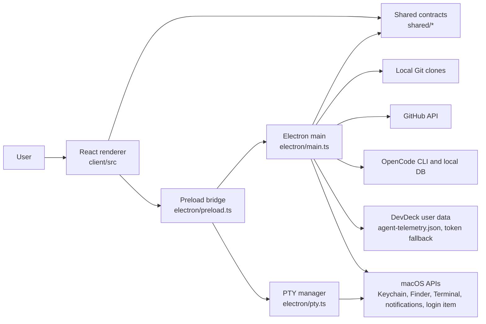
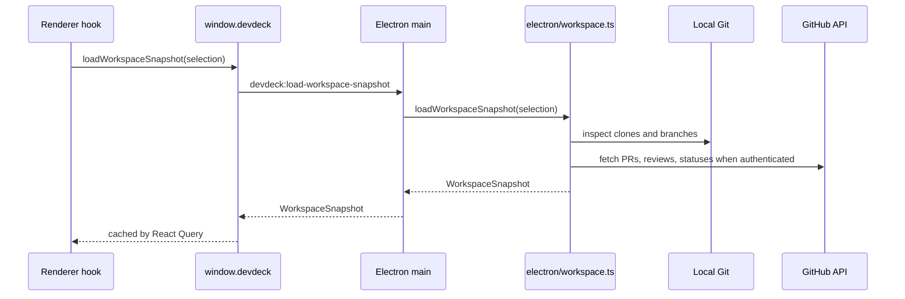
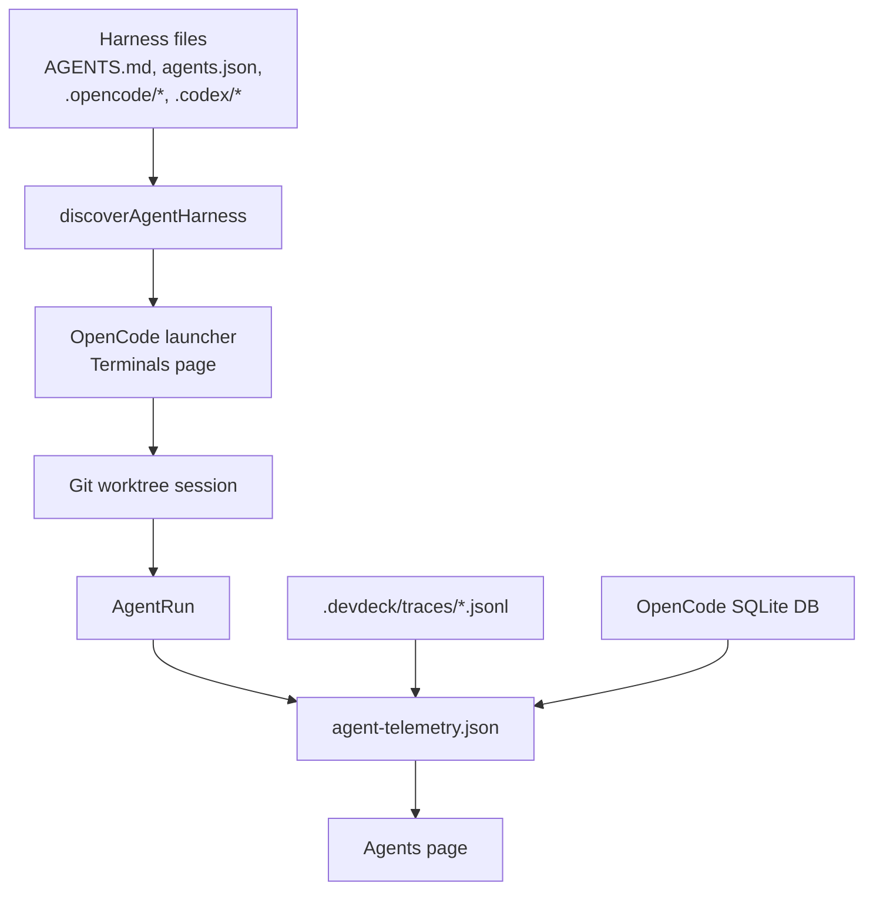

# DevDeck Architecture

DevDeck is a local-first macOS desktop app for monitoring local projects, pull requests, OpenCode sessions, agent harness definitions, and agent productivity telemetry.

The primary runtime is Electron:

- The renderer is a React/Vite app in `client/src`.
- The preload bridge exposes a typed `window.devdeck` desktop API from `electron/preload.ts`.
- The Electron main process owns filesystem, Git, GitHub, OpenCode, notification, menu bar, and PTY operations.
- Shared TypeScript modules in `shared/` define the data contracts used by both sides.
- The Express server in `server/` is a legacy browser shell and currently has no registered `/api` routes.

## Runtime Map

## Source Layout

| Path | Responsibility |
| --- | --- |
| `client/src/App.tsx` | Route registration, onboarding guard, desktop navigation events, theme bootstrap. |
| `client/src/pages/` | Top-level screens: Overview, Pull Requests, Projects, Agents, Terminals, Activity, Settings, Onboarding. |
| `client/src/components/` | Reusable UI and domain components. Project, PR, terminal, workspace, layout, and base UI components live here. |
| `client/src/hooks/` | React hooks for workspace snapshots, agent telemetry, OpenCode sessions, terminal state, preferences, and auto-refresh. |
| `client/src/lib/` | Renderer-only business logic, localStorage helpers, URL builders, scoring, summaries, and testable utility functions. |
| `electron/main.ts` | Electron app lifecycle, IPC handlers, background refresh, notifications, menu bar, GitHub auth, and native commands. |
| `electron/preload.ts` | Safe bridge that exposes `window.devdeck` to the renderer. This is the public desktop API surface. |
| `electron/pty.ts` | Embedded terminal process lifecycle with `node-pty`. |
| `electron/workspace.ts` | Local repository discovery, Git status scanning, GitHub PR sync, workspace snapshot assembly. |
| `electron/agent-harness.ts` | Agent and workflow discovery from project/workspace harness files. |
| `electron/agent-telemetry-store.ts` | Durable agent run, trace, and token usage persistence. |
| `electron/opencode-sessions.ts` | OpenCode CLI availability and session listing/renaming. |
| `electron/opencode-usage.ts` | Read-only OpenCode SQLite usage import. |
| `shared/` | Cross-process data types and pure normalization/summarization logic. |
| `server/` | Legacy Express/Vite browser shell. It builds for compatibility but does not back the desktop runtime. |
| `script/` | Build, Electron bundle, icon generation, notarization, and release preflight scripts. |
| `e2e/` | Playwright desktop and native smoke tests. |

## Application Flow

1. `npm run dev` starts Vite on `127.0.0.1:5000`, watches Electron bundles, and launches Electron.
2. `electron/main.ts` sets the app user-data path, creates the BrowserWindow, loads `electron/preload.ts`, and registers IPC handlers.
3. The renderer starts through `client/src/main.tsx` and `client/src/App.tsx`.
4. In Electron, Wouter uses hash routing so packaged builds can serve routes from a local HTML file.
5. `AppRouter` redirects to onboarding until a valid workspace selection exists.
6. Pages and hooks read state through React Query and `window.devdeck`.
7. The Electron main process performs native work and returns shared data contracts to the renderer.

## Data Flow

Workspace data starts with a `WorkspaceSelection` and becomes a `WorkspaceSnapshot`.

Agent and OpenCode telemetry flows separately:

## State and Persistence

DevDeck uses several storage layers:

- React Query caches loaded data in memory for the active renderer session.
- Local UI preferences and browser-compatible fallback state use `localStorage`.
- Desktop agent telemetry persists in `agent-telemetry.json` under the DevDeck user-data directory.
- GitHub credentials use macOS Keychain by default. File storage is available when `DEVDECK_GITHUB_STORAGE=file`.
- Workspace scans read local Git repositories directly and do not require a database.
- OpenCode usage is read from OpenCode's local SQLite database and normalized into DevDeck telemetry.

The default user-data path is:

- macOS: `~/Library/Application Support/DevDeck`
- other platforms: `~/.devdeck`

Tests can override it with `DEVDECK_USER_DATA_PATH`.

## Main Domain Models

Canonical model definitions live in `shared/`.

| Model | File | Used for |
| --- | --- | --- |
| `WorkspaceSelection` | `shared/workspace.ts` | Selected local projects and workspace root. |
| `WorkspaceSnapshot` | `shared/workspace.ts` | Project health, PRs, activity, insights, GitHub state, user activity. |
| `AgentDefinition` | `shared/agents.ts` | Discovered agent responsibility, skills, tools, and scope. |
| `WorkflowDefinition` | `shared/agents.ts` | Multi-step agent workflow definitions. |
| `AgentRun` | `shared/agents.ts` | A launched or tracked agent execution. |
| `TaskTraceEntry` | `shared/agents.ts` | Captured trace events for an agent run. |
| `TokenUsageEvent` | `shared/agents.ts` | Normalized token and cost measurements by agent, run, project, and workflow. |
| `OpenCodeSessionRecord` | `shared/opencode-sessions.ts` | OpenCode sessions discovered through the CLI. |
| `OpenCodeUsageRecord` | `shared/opencode-usage.ts` | OpenCode token usage imported from local SQLite. |
| `SpawnPtyRequest` | `shared/terminals.ts` | Embedded terminal spawn contract. |

## Navigation and Routes

Routes are defined in `client/src/App.tsx`.

| Route | Page | Notes |
| --- | --- | --- |
| `/` | `Dashboard` | Overview and project health. |
| `/onboarding` | `Onboarding` | Workspace and initial setup. |
| `/reviews` | `Reviews` | Pull request review queue. |
| `/projects` | `Projects` | Project list, details, worktrees, graph, conflicts, OpenCode start. |
| `/repositories` | redirect | Legacy route that redirects to `/projects`. |
| `/agents` | `Agents` | Agent harness, runs, traces, usage, exports, diagnostics. |
| `/terminals` | `Terminals` | Embedded terminals, OpenCode sessions, and OpenCode launcher. |
| `/activity` | `Activity` | Local development activity. |
| `/settings` | `Settings` | Preferences, integrations, workspace selection, background mode. |

OpenCode launch URLs use `/terminals?launch=opencode` plus optional query params:

| Query param | Meaning |
| --- | --- |
| `project` | Workspace project id to launch from. |
| `pr` | Pull request id to link. |
| `agent` | Harness agent id. |
| `workflow` | Harness workflow id. |
| `task` | Agent task title. |
| `base` | Base ref for a worktree. |
| `branch` | Worktree branch name. |
| `sourceRun` | Prior agent run id for handoffs. |

Use `client/src/lib/dev-sessions.ts` and `client/src/lib/agent-launch.ts` to construct these URLs. Do not hand-build launch URLs in components.

## Agent Harness Discovery

`electron/agent-harness.ts` scans project paths and the selected workspace root for known harness files:

- `AGENTS.md`
- `agents.md`
- `CLAUDE.md`
- `agents.json`
- `agent-harness.json`
- `harness.json`
- `agents.yaml`
- `agents.yml`
- `.opencode/agents.json`
- `.opencode/agents.md`
- `.opencode/harness.json`
- `.opencode/workflows.json`
- `.codex/AGENTS.md`
- `.codex/agents.json`
- `.codex/harness.json`

JSON harnesses can define `agents` and `workflows`. Markdown harnesses are parsed into agent responsibilities and metadata where possible. The normalized result is `AgentHarnessDiscoveryResult`.

Recommendation and launch defaulting logic lives in `client/src/lib/agent-launch.ts`.

## Agent Telemetry

Agent telemetry has three slices:

- `agentRuns`: run status, task title, linked project, branch, worktree, workflow, and OpenCode session.
- `taskTraceEntries`: trace summaries, touched files, commands, tests, errors, handoff target, and next action.
- `tokenUsageEvents`: token buckets, model/provider, cost, and run/project/workflow links.

The desktop store is handled by `electron/agent-telemetry-store.ts`. The renderer hooks in `client/src/hooks/use-agent-telemetry.ts` hydrate from the desktop store when available and fall back to localStorage in non-desktop contexts.

## Background Monitoring

`electron/main.ts` keeps an in-memory workspace monitor state. The renderer sends preferences and selection through `syncWorkspaceMonitorState`. The main process can:

- refresh workspace snapshots on an interval
- refresh on window focus
- send `devdeck:workspace-snapshot-updated` events
- update the macOS dock badge
- show desktop notifications
- keep the app alive after closing the main window when background mode is enabled
- expose menu bar actions through `electron/menubar.ts`

## Coding Guidelines for Agents

- Put cross-process contracts in `shared/` first, then update preload and IPC handlers.
- Keep Electron-only filesystem, shell, GitHub, Keychain, OpenCode, and PTY work out of the renderer.
- Use hooks in `client/src/hooks/` to call `window.devdeck`; do not call IPC directly from React components.
- Use `client/src/lib/` for pure renderer logic and add focused tests next to those utilities.
- Keep URL construction centralized in `client/src/lib/dev-sessions.ts`, `client/src/lib/agent-launch.ts`, and `client/src/lib/agent-runs.ts`.
- Preserve the local-first model. Do not add a required remote backend for desktop workflows.
- When changing agent telemetry, update `shared/agents.ts`, `shared/agent-telemetry.ts`, renderer hooks, Electron store code, and tests together.
- When adding a desktop API method, update `electron/preload.ts`, `client/src/env.d.ts`, `electron/main.ts` or a dedicated Electron module, and `docs/API.md`.

