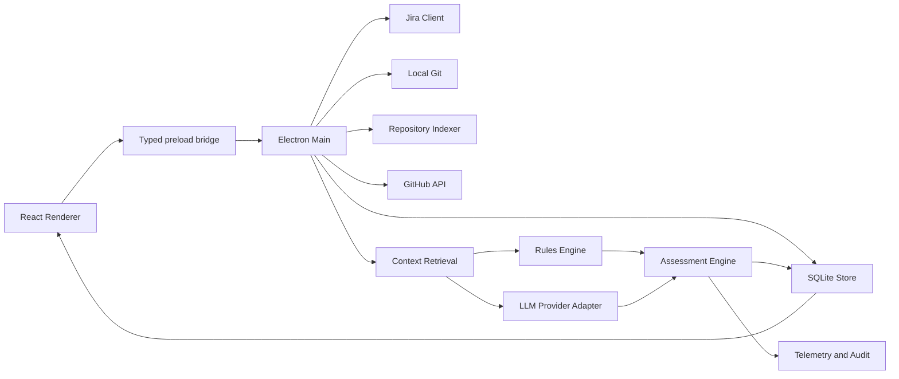

# DevDeck Backlog Intelligence — Integration Plan

**Document type:** Product and engineering implementation plan  
**Product:** DevDeck  
**Capability:** Backlog Intelligence / Backlog Health  
**Status:** Proposed  
**Audience:** Tech Leads, Staff/Principal Engineers, Product Engineering  
**Last updated:** 2026-08-02

---

## 1. Executive summary

This document proposes a phased integration of **Backlog Intelligence** into DevDeck.

The capability will correlate Jira backlog items—tasks, stories, bugs, epics, spikes, and subtasks—with technical evidence found in local repositories, Git history, GitHub pull requests, commits, tests, configuration, migrations, and engineering activity.

Its purpose is not to “let AI clean the backlog.” Its purpose is to give engineering teams an evidence-backed review system that helps determine whether backlog items:

- are still valid;
- may already have been implemented;
- appear to be only partially implemented;
- have become obsolete;
- are likely duplicates;
- reference components that no longer exist;
- are underspecified or stale;
- should be rewritten before prioritisation;
- lack enough evidence for a responsible decision.

The first production-worthy version should be **read-only and human-in-the-loop**. DevDeck may classify, explain, and recommend, but it must not change Jira without explicit user approval.

The implementation must preserve DevDeck’s existing architectural principles:

1. **Local-first by default.**
2. Electron owns filesystem, Git, credentials, and external integrations.
3. The React renderer communicates through a typed `window.devdeck` bridge.
4. Sensitive information remains local whenever practical.
5. Every recommendation must be explainable and auditable.
6. An LLM is a reasoning and summarisation component, not a source of truth.
7. “No evidence found” must never be treated as “evidence that the item is invalid.”
8. Write operations require a separate permission model and explicit confirmation.

The recommended delivery strategy is to build value in layers:

- first, synchronise Jira safely;
- then gather deterministic evidence from Git and GitHub;
- then produce rules-based assessments;
- only then introduce LLM-assisted synthesis;
- finally add controlled write-back and continuous monitoring.

The first meaningful release should be a **Backlog Health Scan** that analyses a selected Jira backlog against selected local repositories and produces a review queue with evidence, confidence, contradictions, and suggested actions.

---

## 2. Product context

DevDeck is a local-first macOS engineering workspace built with Electron, React, Vite, and TypeScript. It already provides:

- local repository discovery and scanning;
- Git branch and activity visibility;
- GitHub pull request and status integration;
- project-level workspace context;
- OpenCode session launch and tracking;
- agent definitions and workflows;
- agent run and token telemetry;
- background refresh and native notifications;
- typed shared contracts across renderer and Electron;
- unit, integration, and desktop E2E testing;
- macOS packaging and release workflows.

This makes DevDeck a strong host for Backlog Intelligence. The new capability extends the product from:

> observing the current state of engineering work

into:

> comparing planned work with the real state and history of the codebase.

DevDeck should not become another Jira client. Jira remains the planning system of record. DevDeck becomes the analytical layer that reconciles planning artefacts with implementation evidence.

---

## 3. Product vision

### 3.1. Core value proposition

> Jira describes what the team believes still needs to be done.  
> Git and GitHub describe what actually changed.  
> DevDeck compares the two and surfaces inconsistencies with evidence.

### 3.2. Target user workflow

A user should be able to:

1. Connect a Jira Cloud account.
2. Select one or more Jira projects.
3. Map each Jira project or component to one or more DevDeck repositories.
4. Define a backlog subset through guided filters or JQL.
5. Synchronise relevant issues locally.
6. Run a Backlog Health Scan.
7. Review classification, confidence, and evidence.
8. Inspect related commits, pull requests, files, symbols, tests, and issues.
9. Accept, reject, or correct the recommendation.
10. Export findings.
11. Later, apply approved Jira changes through a controlled write-back flow.

### 3.3. Product boundary

The system may establish that:

- a component was removed;
- a feature appears to exist;
- a pull request referenced an issue;
- an equivalent bug was fixed;
- acceptance criteria no longer match the architecture.

It cannot automatically establish that:

- a customer still needs the feature;
- the implementation fully satisfies business intent;
- a production rollout succeeded;
- a contractual or compliance requirement no longer applies;
- an issue should be deprioritised.

The language and UX must preserve this distinction.

---

## 4. Product and engineering principles

### 4.1. Evidence first

Every assessment must point to concrete evidence:

- Jira fields, comments, history, and links;
- Git commits and file history;
- GitHub pull requests;
- source files and symbols;
- tests, migrations, and configuration;
- documentation;
- component removal;
- repository activity.

An assessment without sufficient evidence must resolve to:

```text
insufficient_evidence
```

### 4.2. Deterministic before probabilistic

Evidence should be retrieved in this order:

1. exact issue key references in commits;
2. exact issue key references in pull requests;
3. explicit Jira links;
4. exact component, service, endpoint, symbol, or error-message matches;
5. file history and blame;
6. tests, migrations, and configuration;
7. lexical code search;
8. semantic retrieval;
9. LLM-assisted interpretation and summarisation.

### 4.3. Human-in-the-loop

The initial release must not automatically:

- close issues;
- change priority;
- edit descriptions;
- add comments;
- transition workflow state;
- mark duplicates;
- create replacement issues.

### 4.4. Local-first

The local store should support:

- offline access to synchronised Jira data;
- repeated analysis of local repositories;
- evidence caching;
- scan history;
- human feedback;
- local exports;
- provider-independent rules-only operation.

### 4.5. Least privilege

Jira should initially use read-only permissions. Write permissions should only be requested after write-back capabilities exist and are explicitly enabled.

### 4.6. Built-in observability

Every scan must capture:

- scan ID;
- timestamps;
- engine, prompt, and schema versions;
- repository HEAD SHAs;
- sources consulted;
- commands executed;
- duration by stage;
- errors and fallback paths;
- token and cost data;
- assessment output;
- human feedback.

---

## 5. Scope

### 5.1. MVP scope

- Jira Cloud.
- API-token authentication initially, behind an abstraction that supports OAuth later.
- Project, issue type, workflow status, and issue discovery.
- Configurable JQL.
- Jira project-to-repository mapping.
- Issue summary, description, comments, labels, links, and selected history.
- Local Git evidence collection.
- GitHub commit and pull request evidence.
- Lexical source search.
- Deterministic classification.
- Confidence and contradiction modelling.
- Issue review UI.
- Human feedback.
- Markdown, CSV, and JSON exports.
- Local SQLite persistence.
- Manual scans.
- Unit, integration, security, performance, and E2E tests.

### 5.2. Out of scope for the MVP

- automatic Jira mutation;
- Jira Data Center support;
- mandatory remote backend;
- external vector database;
- fine-tuning or autonomous learning;
- production telemetry integration;
- Slack, Confluence, Datadog, or CRM integration;
- automatic bulk closure;
- automatic story-point changes;
- autonomous pull request creation;
- arbitrary agent code execution;
- customer-impact inference without customer data.

---

## 6. Domain model

### 6.1. Evidence

```ts
export type EvidenceKind =
  | "jira_field"
  | "jira_comment"
  | "jira_history"
  | "jira_link"
  | "git_commit"
  | "github_pull_request"
  | "code_file"
  | "code_symbol"
  | "test"
  | "migration"
  | "configuration"
  | "documentation"
  | "component_removed"
  | "repository_activity";
```

### 6.2. Assessment

A structured evaluation of one issue for a specific scan and repository snapshot.

### 6.3. Scan

A bounded execution against:

- a specific Jira snapshot;
- a defined repository set;
- exact repository HEAD SHAs;
- a defined engine and prompt version.

### 6.4. Repository mapping

An explicit relationship between a Jira project, component, label, or issue and one or more local repositories.

### 6.5. Recommendation

A proposed human action. A recommendation is never equivalent to an applied Jira mutation.

---

## 7. Initial classification model

```ts
export type BacklogClassification =
  | "valid"
  | "possibly_implemented"
  | "partially_implemented"
  | "possibly_obsolete"
  | "possible_duplicate"
  | "needs_rewrite"
  | "insufficient_evidence";
```

- **valid:** evidence suggests the requirement or problem remains relevant and is not implemented.
- **possibly_implemented:** strong evidence indicates equivalent behaviour exists.
- **partially_implemented:** part of the requirement exists, but identifiable gaps remain.
- **possibly_obsolete:** the issue depends on an architecture, component, workflow, or assumption that no longer exists.
- **possible_duplicate:** another issue appears to describe substantially the same intent in the same context.
- **needs_rewrite:** the intent may remain valid, but the issue is no longer actionable as written.
- **insufficient_evidence:** the system cannot responsibly recommend a stronger classification.

---

## 8. Confidence model

Confidence must not be a raw model-generated value.

```ts
export interface AssessmentSignal {
  id: string;
  category:
    | "explicit_reference"
    | "structural_match"
    | "semantic_match"
    | "temporal"
    | "contradiction"
    | "absence"
    | "duplicate_similarity";
  score: number;
  weight: number;
  evidenceIds: string[];
}
```

Suggested initial weights:

| Signal | Weight |
|---|---:|
| Commit references issue key | 1.00 |
| Pull request references issue key | 1.00 |
| Merged PR has equivalent intent | 0.90 |
| Dedicated test introduced | 0.85 |
| Referenced component removed | 0.90 |
| Exact symbol exists | 0.75 |
| Strong lexical match | 0.60 |
| Semantic match | 0.35 |
| Old issue with no recent activity | 0.20 |
| No reference found | 0.05 |

Age alone must never justify obsolescence.

Display bands:

- `>= 0.85`: high confidence;
- `0.65–0.84`: medium confidence;
- `< 0.65`: low confidence.

---

## 9. Target architecture



### Renderer

Owns configuration, filters, presentation, navigation, review state, and React Query caching. It must not store tokens, call Jira or an LLM directly, execute Git, read arbitrary paths, or construct shell commands.

### Preload

Exposes a narrow typed API, validates payloads, and prevents arbitrary Electron access.

### Electron

Owns credentials, external APIs, Git, indexing, persistence, scans, provider calls, exports, background jobs, and audit data.

### Shared

Owns canonical types, Zod schemas, enums, pure normalisation functions, and schema-version metadata.

---

## 10. Proposed source layout

```text
shared/
├── backlog.ts
├── backlog-schemas.ts
├── jira.ts
├── repository-context.ts
├── assessments.ts
└── scan-events.ts

electron/
├── backlog/
│   ├── backlog-service.ts
│   ├── scan-orchestrator.ts
│   ├── assessment-engine.ts
│   ├── classification-rules.ts
│   ├── confidence.ts
│   ├── evidence-normalizer.ts
│   ├── export-service.ts
│   └── errors.ts
├── jira/
│   ├── jira-client.ts
│   ├── jira-auth.ts
│   ├── jira-sync.ts
│   ├── jira-normalizer.ts
│   ├── jira-rate-limit.ts
│   └── jira-errors.ts
├── repository-index/
│   ├── repository-indexer.ts
│   ├── git-search.ts
│   ├── code-search.ts
│   ├── symbol-extractor.ts
│   ├── ignore-rules.ts
│   ├── index-store.ts
│   └── repository-fingerprint.ts
├── retrieval/
│   ├── issue-query-builder.ts
│   ├── context-retrieval.ts
│   ├── evidence-ranking.ts
│   ├── duplicate-search.ts
│   └── context-budget.ts
├── ai/
│   ├── provider.ts
│   ├── provider-registry.ts
│   ├── assessment-prompt.ts
│   ├── structured-output.ts
│   ├── redaction.ts
│   └── model-policy.ts
├── persistence/
│   ├── backlog-db.ts
│   ├── migrations/
│   ├── repositories/
│   └── transaction.ts
└── backlog-ipc.ts

client/src/
├── pages/backlog.tsx
├── components/backlog/
├── hooks/
└── lib/
```

---

## 11. Local persistence

Use SQLite for this domain because it requires relational queries, pagination, scan history, many-to-many relationships, full-text search, migrations, transactions, and large evidence volumes.

Storage location:

```text
~/Library/Application Support/DevDeck/backlog-intelligence.sqlite
```

Recommended settings:

- WAL mode;
- foreign keys enabled;
- busy timeout;
- explicit transactions;
- versioned migrations;
- pre-migration backup;
- startup schema-version guard.

Core tables:

- `jira_connections`;
- `jira_projects`;
- `backlog_mappings`;
- `jira_issues`;
- `jira_comments`;
- `jira_issue_links`;
- `repository_snapshots`;
- `scans`;
- `scan_items`;
- `evidence`;
- `assessments`;
- `assessment_feedback`.

At minimum, index issue key, project/status, update timestamps, scan state, issue evidence, and assessment history. Use FTS5 for summary, description, and comments when available.

---

## 12. Security and privacy

### Jira credentials

Store credentials in macOS Keychain under a dedicated DevDeck Jira service. Tokens must never be written to SQLite, localStorage, logs, crash reports, exports, or telemetry.

### AI data policy

```ts
export type AiDataPolicy =
  | "disabled"
  | "metadata_only"
  | "selected_context"
  | "full_retrieved_context";
```

Recommended default: `selected_context`.

### Redaction

Block or remove:

- API keys and tokens;
- `.env` values;
- private keys;
- passwords;
- certificates;
- connection strings;
- user-defined sensitive patterns;
- denied files.

Default deny patterns:

```text
.env*
*.pem
*.key
*.p12
*.jks
secrets/**
credentials/**
node_modules/**
dist/**
build/**
.git/**
```

### Audit trail

Record provider, timestamp, input size, source hashes, data policy, model, latency, token usage, and result status—never credentials.

---

## 13. Jira integration

### Authentication

Initial implementation: base URL, account email, and API token. The architecture must support Jira Cloud OAuth 2.0 later.

```ts
export interface JiraCredentialProvider {
  getAccessToken(connectionId: string): Promise<string>;
  invalidate(connectionId: string): Promise<void>;
}
```

### Jira client

```ts
export interface JiraClient {
  testConnection(): Promise<JiraConnectionHealth>;
  listProjects(): Promise<JiraProject[]>;
  listIssueTypes(projectKey: string): Promise<JiraIssueType[]>;
  searchIssues(request: JiraSearchRequest): Promise<JiraSearchPage>;
  getIssue(issueKey: string): Promise<JiraIssueDetail>;
  getIssueChangelog(issueKey: string): Promise<JiraChangelogEntry[]>;
  getComments(issueKey: string): Promise<JiraComment[]>;
}
```

### Resilience

- retry transient failures only;
- exponential backoff with jitter;
- honour `Retry-After`;
- support `AbortSignal`;
- explicit pagination;
- bounded concurrency;
- request timeouts;
- normalised DevDeck error codes.

### Synchronisation

1. Full sync for configured JQL.
2. Persist `updated_at`.
3. Incremental sync from `lastSuccessfulSync`.
4. Periodic full reconciliation.
5. Mark issues leaving the filter as `out_of_scope` rather than deleting them.

Provide guided filters, an advanced JQL editor, preview count, validation, and saved filters.

---

## 14. Jira-to-repository mapping

Mapping precedence:

1. issue-level override;
2. Jira component;
3. Jira label;
4. project fallback.

Rules:

- never scan all repositories implicitly;
- show the exact repository set before scanning;
- persist the HEAD SHA used;
- allow temporary exclusions;
- show unavailable repositories clearly;
- mark assessments stale after relevant repository changes.

---

## 15. Repository indexing

The first index should capture paths, file types, hashes, symbols where practical, issue-key references, commit metadata, relevant branches, last change, authors, and bounded snippets.

Use safe process spawning with argument arrays, never interpolated shell commands.

Potential Git operations:

```bash
git log --all --grep="<ISSUE_KEY>"
git log --all --oneline --decorate
git log -S "<term>"
git log -G "<regex>"
git blame <file>
git show <sha>
```

Use `ripgrep` where available, with a Node fallback. Search for issue keys, services, endpoints, error messages, classes, functions, and acceptance-criteria language.

Incremental fingerprint:

```text
repository path + HEAD SHA + indexer version + ignore-policy hash
```

Skip binaries, oversized files, generated code, dependencies, and denied paths. Bound snippets, time, and memory per repository.

---

## 16. Context retrieval

```text
Normalised Jira issue
  ↓
Technical term extraction
  ↓
Repository selection
  ↓
Exact reference search
  ↓
Git history search
  ↓
Current-code lexical search
  ↓
GitHub pull request search
  ↓
Jira duplicate candidate search
  ↓
Ranking and deduplication
  ↓
Bounded context package
```

Extract issue key, summary, code identifiers, paths, URLs, error messages, components, labels, acceptance criteria, services, endpoints, versions, dates, and domain terms.

```ts
export interface ContextBudget {
  maxEvidenceItems: number;
  maxCharacters: number;
  maxItemsPerKind: number;
  reserveForIssue: number;
  reserveForInstructions: number;
}
```

Priority:

1. explicit references;
2. direct code/history changes;
3. current implementation state;
4. contradictions;
5. duplicate candidates;
6. semantic context.

Merge duplicate evidence discovered through local Git and GitHub.

---

## 17. Duplicate detection

The MVP should use full-text search, shared components, labels, technical terms, existing Jira links, and simple text similarity.

An issue may be classified as `possible_duplicate` only when a concrete candidate exists, intent substantially overlaps, the relevant scope matches, and the system explains both similarities and differences. Title similarity alone is insufficient.

---

## 18. Rules engine

Deterministic rules execute before any LLM call.

```ts
if (mergedPrReferencesIssue && currentCodeContainsFeatureSignal) {
  addSignal("possibly_implemented", 0.95);
}

if (referencedComponentRemoved && noReplacementMentioned) {
  addSignal("possibly_obsolete", 0.90);
}

if (issueHasMergedPrButAcceptanceCriteriaRemainPartiallyUnmatched) {
  addSignal("partially_implemented", 0.80);
}
```

The engine must preserve contradictions. A merged PR combined with a skipped test, remaining TODO, or recent reproduction comment should reduce confidence and produce an investigation recommendation.

---

## 19. LLM-assisted assessment

The LLM may extract concepts, compare intent with evidence, summarise, identify missing criteria, propose rewrites, generate questions, and structure a recommendation.

It must not execute operations, determine confidence independently, invent evidence, assert production deployment without proof, or infer customer usage.

```ts
export interface AssessmentProvider {
  assess(input: AssessmentInput): Promise<AssessmentModelOutput>;
}
```

Validate structured output with Zod. Reject unknown evidence IDs, oversized output, and invalid classifications. Retry invalid structured output once, then fall back to rules-only. Version the engine, prompt, and schema.

---

## 20. Desktop API and IPC

The typed API should cover:

- Jira connection management;
- project discovery;
- JQL preview and sync;
- repository mapping;
- issue listing and detail;
- scan start, cancellation, state, and history;
- assessment detail;
- human feedback;
- export.

Desktop events should include scan started, progress, per-issue started/completed/failed, scan completed, and scan cancelled.

---

## 21. User experience

Add route:

```text
/backlog
```

Recommended sections:

- Overview;
- Issues;
- Scans;
- Mappings;
- Settings.

### Onboarding

1. Connect Jira.
2. Enter base URL, email, and token.
3. Test connection.
4. Select project.
5. Select repositories.
6. Configure filter or JQL.
7. Preview issue count.
8. Run initial sync.

### Dashboard

Show synchronised and analysed issues, classification distribution, confidence distribution, items awaiting review, recent scans, feedback acceptance rate, and high-confidence quick wins.

### Issue detail

Recommended layout:

```text
Issue | Assessment | Evidence
```

Display Jira content, classification, confidence, signals, evidence, contradictions, questions, recommendation, suggested rewrite, and feedback.

Avoid definitive language such as “This issue is obsolete.” Prefer “Possibly obsolete — high confidence,” followed by evidence.

---

## 22. Agent and OpenCode integration

Add a `backlog-reviewer` agent responsible for investigating one issue using authorised sources and producing cited evidence.

Workflow:

```text
Load issue
→ Build search terms
→ Search Git history
→ Search current code
→ Search GitHub pull requests
→ Compare acceptance criteria
→ Produce assessment
→ Request human review
```

From an issue detail page, support **Investigate in OpenCode** with project, task, agent, workflow, base branch, issue key, assessment ID, and evidence references. OpenCode must not mutate the persisted assessment without an explicit user action.

---

## 23. Background processing

The MVP should use manual Jira sync and manual scans.

Later, add daily sync, reindex after meaningful changes, scheduled scans, notifications for new evidence, and targeted re-analysis after related PRs merge.

```ts
export interface BacklogMonitorState {
  enabled: boolean;
  connectionIds: string[];
  syncIntervalMinutes: number;
  autoScanPolicy: "off" | "changed_issues" | "scheduled";
}
```

---

## 24. Performance and scalability

Initial targets for 500 issues and five medium repositories:

- incremental Jira sync under 60 seconds, API-dependent;
- initial index under two minutes per repository;
- incremental reindex under ten seconds;
- rules-only analysis under three seconds per issue;
- LLM-assisted analysis under twenty seconds per issue;
- responsive UI and bounded memory.

Suggested concurrency:

- Jira: 3–5;
- Git: 2;
- code search: 2–4;
- LLM: 2;
- SQLite writes: serialised.

All long-running work must support cooperative cancellation.

---

## 25. Error handling and degraded modes

```ts
export type BacklogErrorCode =
  | "JIRA_AUTH_FAILED"
  | "JIRA_RATE_LIMITED"
  | "JIRA_UNAVAILABLE"
  | "JQL_INVALID"
  | "REPOSITORY_NOT_FOUND"
  | "GIT_COMMAND_FAILED"
  | "INDEX_FAILED"
  | "LLM_UNAVAILABLE"
  | "LLM_OUTPUT_INVALID"
  | "DATABASE_ERROR"
  | "SCAN_CANCELLED"
  | "PERMISSION_DENIED";
```

One issue failure must not fail a scan. LLM failure falls back to rules-only. GitHub failure continues with local Git. Jira failure during analysis may use the local snapshot. The UI must show partial results and degraded-state warnings.

---

## 26. Testing strategy

### Unit tests

Cover Jira normalisation, issue-key parsing, query construction, ranking, confidence, rules, redaction, ignore policies, schemas, deduplication, and export formatting.

### Integration tests

Cover a Jira mock server, authentication, pagination, rate limiting, SQLite migrations, Git fixtures, commit/PR linking, IPC, cancellation, retries, and rules-only fallback.

### Golden evaluation tests

Build a curated corpus including true positives, false-positive traps, contradictions, removed components, partial implementations, misleading title similarity, and insufficient evidence.

### E2E

Connect to mock Jira, select a project, map a repository, synchronise, scan, inspect evidence, submit feedback, and export.

### Security

Verify that tokens never reach logs, renderer cannot read Keychain, path traversal and shell injection are blocked, sensitive files are excluded, model output is validated, and exports contain no secrets.

### Performance

Test 10,000 issues, 100,000 evidence rows, incremental reindexing, pagination, cancellation, memory, and migration startup time.

---

## 27. Success metrics

### Product

- recommendations reviewed;
- recommendation acceptance rate;
- issues rewritten or closed after review;
- time saved per grooming session;
- issues reviewed per session;
- recurring weekly use.

### Quality

- precision by classification;
- false-positive rate;
- `insufficient_evidence` rate;
- invalid evidence-reference rate, target 0%;
- human agreement;
- confidence calibration error.

### Engineering

- scan failure rate;
- time per issue;
- cache hit rate;
- reindex duration;
- cost per issue;
- crash rate;
- migration failures.

---

# 28. Phased implementation plan

## Phase 0 — Discovery, ADRs, and baseline

**Objective:** Resolve high-impact decisions before major implementation.

**Deliverables:** product brief, threat model, ADRs for SQLite, Jira auth, provider abstraction, no embeddings in MVP, human-in-the-loop, evaluation dataset, UX wireframes, and baseline metrics.

**Exit criteria:** ADR approval, reviewed schema, validated UX flow, 20–30 anonymised issues, critical risks documented, and a go/no-go decision.

**Estimate:** 1–2 weeks.

---

## Phase 1 — Domain foundation and persistence

**Status (2026-08-18): implemented.** See `shared/backlog.ts`, `shared/backlog-schemas.ts`, `shared/feature-flags.ts`, `shared/engineering-brain-schemas.ts`, `electron/persistence/`, `electron/engineering-brain/`, `electron/engineering-brain-ipc.ts`, and `client/src/pages/Backlog.tsx`.

**Objective:** Create contracts and storage without real external integration.

**Deliverables:** shared types, Zod schemas, SQLite, migrations, repository layer, IPC skeleton, Backlog route, and feature flag.

**Acceptance criteria:** automatic database creation, idempotent migrations, typed empty states, no credential persistence, and passing type check, tests, build, and packaging.

- automatic database creation and idempotent migrations: ✅ (`backlog-db.test.ts`, `migration-runner.test.ts`);
- typed empty states: ✅ `EMPTY_BACKLOG_SUMMARY`, the disabled-by-default Backlog route shell;
- no credential persistence: ✅ nothing in this phase touches Jira, GitHub, or Keychain;
- type check, tests, build: ✅ on Linux;
- packaging: ⚠️ `npm run build` (esbuild bundle) passes; **`electron-builder --mac` packaging, signing, and notarisation with `better-sqlite3` have not been exercised** — this repository's execution environment has no macOS. Do this before relying on the interim SQLite driver decision in ADR-0003.

A repository layer over the schema v1 tables (typed query/insert helpers for `jira_issues`, `scans`, etc.) was intentionally **not** built in Phase 1: nothing writes to those tables until Jira sync (Phase 2) and evidence collection (Phase 3) exist, so a repository layer today would be speculative, untestable code. Add it alongside the feature that first needs it.

**Estimate:** 1–2 weeks. Actual: implemented in one session, minus the macOS packaging validation above.

---

## Phase 2 — Read-only Jira connection and sync

**Status (2026-08-27): implemented, validated only against a mocked Jira API.** See `shared/jira.ts`, `shared/jira-schemas.ts`, `electron/jira/`, `electron/persistence/jira-repository.ts`, `electron/jira-ipc.ts`, and the Jira section of `client/src/pages/Backlog.tsx`.

**Objective:** Authenticate and synchronise Jira locally.

**Deliverables:** connection UI, Keychain, project discovery, JQL preview, full/incremental sync, and issue list.

**Acceptance criteria:** tested connection, Keychain token storage, paginated sync of at least 1,000 issues, incremental updates, actionable JQL errors, offline browsing, and no Jira mutation.

- tested connection, Keychain token storage: ✅ `testAndSaveConnection` validates against Jira before storing; Keychain on macOS, file fallback (0600) elsewhere;
- paginated sync of at least 1,000 issues: ⚠️ pagination itself is implemented and tested against a stubbed multi-page response; **reliability at real scale against a real Jira Cloud site has not been exercised** — this repository's execution environment has no Jira instance or credentials. Validate before depending on this for a real backlog;
- incremental updates: ✅ relative-window JQL, never touches `out_of_scope` (only a full sync may);
- actionable JQL errors: ✅ `JQL_INVALID` / `PERMISSION_DENIED` preserve Jira's own error text;
- offline browsing: ✅ `JiraIssuesTable` reads only the local SQLite store;
- no Jira mutation: ✅ every client function is a GET or a POST to `/search`.

Not built, deferred to a later phase or a follow-up: a guided-filter UI (JQL editor only, per "guided filters **or** JQL"); issue-detail drill-down (the client already has `getIssue`/`getComments`/`getIssueChangelog`, just no screen uses them yet); saved filters; the general `BacklogErrorCode` taxonomy (BI-003) beyond the Jira-specific codes used here.

**Estimate:** 2–3 weeks. Actual: implemented in one session; live-Jira validation is untimed follow-up work.

---

## Phase 3 — Repository mapping and deterministic evidence

**Status (2026-08-27): implemented.** See `shared/evidence.ts`, `electron/repository-index/`, `electron/persistence/{backlog-mapping,evidence,repository-snapshot}-repository.ts`, `electron/repository-evidence-ipc.ts`, `RepositoryMappingCard`, and the new `/backlog/issues/:issueKey` detail page.

**Objective:** Relate issues to repositories and gather evidence without an LLM.

**Deliverables:** mapping editor, Git search, lexical code search, commit/PR evidence, normalised evidence model, and issue detail.

**Acceptance criteria:** exact commit and PR references are shown, files are navigable, excluded paths are never read, shell injection is prevented, results are reproducible for a HEAD SHA, and scans are cancellable.

- exact commit and PR references are shown, files are navigable: ✅
- excluded paths are never read: ✅ same deny-pattern check on both the ripgrep and Node-fallback code paths, applied before any file is opened
- shell injection is prevented: ✅ every process spawn uses an argument array (`execFile`), never a shell; verified with `grep -rn "shell:\s*true"` finding nothing in this milestone's code
- results are reproducible for a HEAD SHA: ⚠️ true for commit/lexical evidence; GitHub PR search results can change independent of the local HEAD SHA (see the M3 status note in `docs/architecture/DELIVERY_ROADMAP.md`)
- scans are cancellable: ✅ `gatherEvidence` checks an `AbortSignal` before each repository and never persists a partial result

Not built, deferred: deleted/renamed-component detection (`EvidenceKind.component_removed` exists in the type but nothing produces it — needs cross-snapshot diffing); a persisted, incrementally-updated lexical index (search is always live against the current working tree); the full evidence ranking/deduplication model from section 16 (BI-045) — evidence is ordered by strength band on read, not ranked by explicitness/source-reliability/temporal-relevance/contradiction-value the way the RFC describes; a guided mapping-rule builder beyond the plain form shipped here.

**Estimate:** 3–4 weeks. Actual: implemented in one session.

---

## Phase 4 — Rules-only Backlog Health Scan

**Status (2026-08-28): implemented, core scope only.** See `shared/assessment.ts`, `shared/assessment-schemas.ts`, `electron/rules-engine/`, `electron/persistence/{assessment,rules-scan}-repository.ts`, `electron/rules-engine-ipc.ts`, `RulesScanCard` (on `client/src/pages/Backlog.tsx`), and `AssessmentCard` (on the issue detail page).

**Objective:** Produce useful assessments without an LLM dependency.

**Deliverables:** scan orchestration, rules engine, confidence, dashboard, scan history, review workflow, feedback, and exports.

- scan orchestration: ✅ `runRulesScan` (`electron/rules-engine/rules-scan.ts`), wired as the `rules-scan-project` Engineering Brain operation kind — same start/progress/cancel machinery every other long-running operation uses
- rules engine: ⚠️ covers 4 of the RFC's 6 rule categories (section 21) from data Phase 2/3 already collect — implementation evidence (commit/PR/code matches), obsolescence (a project's own JQL filter dropping the issue), duplicate (a Jira issue link naming it a duplicate), and insufficient evidence (the fallback). "Stale specification evidence" needs comparing an issue's description against what the code does — deferred to Phase 5's model layer, not something a rule can do reliably. "Contradiction" isn't a signal generator; it's detected in `confidence.ts` from two rules firing against the same issue (e.g. implementation evidence *and* an obsolescence signal)
- confidence: ✅ deterministic, versioned (`RULES_ENGINE_VERSION`), inspectable — every persisted assessment stores the engine version, rationale, and which evidence ids it cites
- dashboard: ⚠️ `RulesScanCard` shows a per-project classification breakdown and a "run scan" control on the Backlog page; there is no dedicated dashboard page (Phase 6's "advanced triage UX" territory)
- scan history: ⚠️ persisted in full (every scan is its own `scans` row, never overwritten — see the schema note below) and queryable via `listRulesScansForProject`, but the UI only surfaces the latest scan's stats, not a history browser
- review workflow: ⚠️ `AssessmentCard` on the issue detail page shows the latest assessment with rationale, contradictions, open questions, and suggested action; there is no dedicated review queue for grooming many issues at once (Phase 6)
- feedback: ✅ accept / reject / correct-classification with an optional note, persisted to `assessment_feedback`
- exports: ❌ not built — deferred

**Acceptance criteria:** 100-issue end-to-end scan, cited assessments, explainable confidence, isolated failures, persisted feedback, exportable results, and no age-only classifications.

- 100-issue end-to-end scan: ⚠️ the mechanism (paginated issue collection, one scan per project run) handles it, but this has only been exercised against small in-memory test fixtures — not load-tested against a real 100+ issue project, the same live-validation gap Phase 2 already flags for Jira sync at scale
- cited assessments: ⚠️ evidence-grounded signals (implementation) cite real `evidence.id` rows; obsolescence and duplicate-link signals cite Jira's own sync/link state directly in their explanation instead, since no `evidence` row represents that state (see `AssessmentSignal`'s doc comment in `shared/assessment.ts`) — an intentional v1 simplification, not a bug
- explainable confidence: ✅ `aggregateSignals` (`electron/rules-engine/confidence.ts`) is a pure function from signals to classification/confidence/rationale — same input always produces the same output
- isolated failures: ✅ one `scan_items` row per issue (status + error code); one issue's assessment failing does not stop the rest of the scan, matching Phase 3's per-repository isolation
- persisted feedback: ✅
- exportable results: ❌ not built — deferred
- no age-only classifications: ✅ the rule set has no age-based signal at all — an issue with no evidence and not otherwise flagged always lands on `insufficient_evidence` rather than a guess

Not built, deferred: CSV/Markdown export of scan results; a dedicated scan-history browser and review-queue UI (Phase 6); per-issue on-demand assessment (scans only run project-wide from the Backlog page, not from a single issue's page); "stale specification evidence" detection; re-running feedback-informed threshold calibration (the RFC allows it only through an explicit versioned change, and no calibration exists yet to apply).

**Estimate:** 2–3 weeks. Actual: implemented in one session.

---

## Phase 5 — LLM-assisted assessment

**Objective:** Improve intent comparison, gap analysis, and issue rewriting.

**Deliverables:** provider adapter, data-policy UI, redaction, context budgets, structured output, prompt versioning, cost tracking, and hybrid assessment.

**Acceptance criteria:** AI can be disabled; provider failure does not block scans; invalid output is rejected; evidence IDs are validated; submitted context is auditable; secrets are blocked; and evaluation quality exceeds the rules-only baseline.

**Estimate:** 3–4 weeks.

---

## Phase 6 — Advanced triage UX

**Objective:** Support real backlog-grooming sessions.

**Deliverables:** review queues, saved views, scan comparison, rewrite diffs, Markdown export, OpenCode investigation, keyboard navigation, and accessibility improvements.

**Acceptance criteria:** efficient review of 50 issues, understandable history, correct OpenCode context, complete keyboard navigation, and no implicit destructive action.

**Estimate:** 2–3 weeks.

---

## Phase 7 — Controlled Jira write-back

**Objective:** Apply approved actions with permission isolation and auditability.

**Initial actions:** add comment, add label, update description, link duplicate, create follow-up issue. Closing issues remains deferred.

**Safety:** mandatory preview, explicit confirmation, second confirmation for bulk actions, idempotency keys, optimistic locking, conflict detection, audit log, and rollback where possible.

**Estimate:** 3–4 weeks.

---

## Phase 8 — Continuous intelligence

**Objective:** Detect relevant changes over time.

**Deliverables:** scheduled sync, targeted re-analysis, merge-triggered analysis, notifications, new-evidence indicators, freshness, and per-project policies.

**Acceptance criteria:** only affected issues are analysed, budgets are enforced, notifications are configurable, background mode remains efficient, stale assessments are marked, and duplicate scans are prevented.

**Estimate:** 2–4 weeks.

---

## Phase 9 — Semantic index and lightweight knowledge graph

**Objective:** Improve implicit relationship discovery after lexical retrieval reaches measurable limits.

Potential capabilities: local embeddings, symbol index, issue→PR→commit→file→symbol graph, cross-repository search, clustering, and recurring themes.

Proceed only after a stable baseline demonstrates meaningful lexical misses.

---

## Phase 10 — Hardening and broader distribution

**Objective:** Prepare for broader and potentially enterprise use.

**Deliverables:** OAuth, Jira Data Center feasibility decision, backup/restore, DB repair, retention controls, redacted diagnostics, administrative policies, security review, accessibility audit, and migration documentation.

---

## 29. Initial engineering backlog

### Domain foundation

- `BI-001` Define shared types. ✅ `shared/backlog.ts`
- `BI-002` Define Zod schemas. ✅ `shared/backlog-schemas.ts`, `shared/engineering-brain-schemas.ts`
- `BI-003` Define error taxonomy. ❌ deferred — `BacklogErrorCode` (section 25) covers Jira/model/index failures that don't exist yet; add it alongside Phase 2/3.
- `BI-004` Add feature flag. ✅ `shared/feature-flags.ts`
- `BI-005` Add route and navigation. ✅ `client/src/pages/Backlog.tsx`, gated nav item in `AppLayout.tsx`

### Persistence

- `BI-010` Select SQLite driver. ✅ interim: `better-sqlite3`, see ADR-0003
- `BI-011` Build migration runner. ✅ `electron/persistence/migration-runner.ts`
- `BI-012` Create schema v1. ✅ `electron/persistence/migrations/0001-init.ts`
- `BI-013` Build repositories. ❌ intentionally deferred — see the Phase 1 status note above
- `BI-014` Add transaction helper. ⚠️ the migration runner uses `db.transaction()` per migration; no standalone helper exists yet because nothing outside migrations writes to the database in Phase 1
- `BI-015` Add pre-migration backup. ✅ `electron/persistence/backlog-db.ts` (skipped for a brand-new database — nothing to protect)

### Jira

- `BI-020` Keychain credential storage. ✅ `electron/jira/jira-auth.ts` (+ `electron/keychain-storage.ts`)
- `BI-021` Jira client. ✅ `electron/jira/jira-client.ts` — validated against a mocked API only, see Phase 2 status above
- `BI-022` Connection health. ✅ `testConnection`, surfaced via `jira_connections.last_error` / `last_successful_sync_at`
- `BI-023` Project discovery. ✅ `listProjects` (remote), `listJiraProjectConfigs` (local)
- `BI-024` JQL preview. ✅ `devdeck:jira:preview-jql` (count-only search, `maxResults: 0`)
- `BI-025` Full sync. ✅ `runFullJiraSync` — paginated, marks out-of-scope issues
- `BI-026` Incremental sync. ✅ `runIncrementalJiraSync` — relative-window JQL
- `BI-027` Rate-limit and retry handling. ✅ bounded exponential backoff + jitter, `Retry-After` honoured
- `BI-028` ADF normalisation. ✅ `electron/jira/jira-adf.ts`

### Repository evidence

- `BI-040` Safe Git runner. ✅ `electron/repository-index/git-runner.ts` — argv-array `execFile`, no shell, canonical path resolution
- `BI-041` Issue-key commit search. ✅ `searchCommitsByIssueKey` — `--fixed-strings`, case-insensitive
- `BI-042` GitHub PR search. ✅ `electron/repository-index/github-pr-evidence.ts`, reusing the existing GitHub client
- `BI-043` Ripgrep adapter. ✅ `electron/repository-index/code-search.ts` — real `rg --json`, bounded Node fallback when it's missing
- `BI-044` Evidence normalisation. ✅ `electron/repository-index/evidence-gather.ts` + `shared/evidence.ts`
- `BI-045` Evidence ranking. ⚠️ evidence is ordered by strength band on read (`electron/persistence/evidence-repository.ts`), not the full explicitness/source-reliability/temporal/contradiction ranking model from RFC section 20
- `BI-046` Repository fingerprint. ✅ `computeRepositoryFingerprint` in `electron/persistence/repository-snapshot-repository.ts`
- `BI-047` Evidence cache. ✅ persisted evidence is read back until the next explicit gather; repository snapshots are reused for an unchanged HEAD SHA

### Scans and assessment

- `BI-050` Scan lifecycle. ✅ `electron/persistence/rules-scan-repository.ts` — `running` → `completed` / `failed` / `cancelled`, one `scans` row per run (schema v1, built in Phase 1 for exactly this)
- `BI-051` Scan queue. ⚠️ reuses the generic Engineering Brain operation service's `maxConcurrentOperations` policy (same as Jira sync and evidence gather); no scan-specific queue exists beyond that
- `BI-052` Cancellation. ✅ `runRulesScan` checks its `AbortSignal` before each issue and marks the scan `cancelled` rather than leaving it `running`
- `BI-053` Per-issue failure isolation. ✅ one `scan_items` row per issue; one issue's assessment failing does not stop the rest of the scan
- `BI-054` Progress events. ✅ `onProgress` reports `(issues assessed) / (total issues)`, flowing through the existing `engineeringBrain.subscribe` event stream
- `BI-060` Rules engine. ⚠️ `electron/rules-engine/signals.ts` — 4 of the RFC's 6 rule categories, see the Phase 4 status note above
- `BI-061` Signal model. ✅ `AssessmentSignal` (`shared/assessment.ts`) matches the RFC's documented shape exactly
- `BI-062` Confidence model. ✅ `electron/rules-engine/confidence.ts` — deterministic, versioned, sums weighted signal scores per classification
- `BI-063` Contradiction handling. ✅ opposing classifications (e.g. `possibly_implemented` and `possibly_obsolete`) both scoring is recorded in `contradictions` and discounts confidence rather than being silently dropped
- `BI-064` Assessment persistence. ✅ `electron/persistence/assessment-repository.ts` — one row per issue per scan, full history retained
- `BI-065` Human feedback. ✅ accept / reject / correct-classification with an optional note, `assessment_feedback` table

### AI

- `BI-070` Provider adapter.
- `BI-071` Redaction.
- `BI-072` Context budget.
- `BI-073` Prompt v1.
- `BI-074` Structured output.
- `BI-075` Hybrid reconciliation.
- `BI-076` Evaluation harness.

### UI and quality

- `BI-080` Dashboard. ⚠️ `RulesScanCard` (Phase 4) shows a per-project classification breakdown, not a dedicated dashboard page
- `BI-081` Issue table.
- `BI-082` Issue detail.
- `BI-083` Evidence panel.
- `BI-084` Scan progress. ✅ `RulesScanCard`'s progress bar, driven by the `rules-scan-project` operation's progress events (Phase 4)
- `BI-085` Feedback controls. ✅ `AssessmentCard`'s accept / reject / correct-classification controls (Phase 4)
- `BI-086` Saved views. ❌ not built
- `BI-087` Exports. ❌ not built — deferred (Phase 4 status note above)
- `BI-090` Threat model.
- `BI-091` Secret exposure tests.
- `BI-092` Shell injection tests.
- `BI-093` Path traversal tests.
- `BI-094` Performance suite.
- `BI-095` E2E suite.
- `BI-096` Diagnostics.

---

## 30. Definition of Done

A story is complete only when all applicable criteria are met:

- functional requirements implemented;
- shared contracts and schemas updated;
- preload and IPC updated;
- API documented;
- unit and integration tests added;
- E2E coverage for user-facing behaviour;
- loading, empty, error, and degraded states handled;
- cancellation supported for long-running work;
- logs contain no secrets;
- migrations included where required;
- documentation updated;
- accessibility reviewed;
- type check, tests, build, and macOS package validation pass;
- security review completed for external integrations.

---

## 31. Rollout strategy

Feature flag:

```text
backlogIntelligenceEnabled
```

Rollout stages:

1. developer-only;
2. internal alpha;
3. opt-in beta;
4. read-only public beta;
5. write-back beta;
6. general availability.

Kill switches:

- disable Jira sync;
- disable LLM usage;
- disable background scans;
- disable Jira write-back;
- disable a specific provider;
- force rules-only mode.

---

## 32. Primary risks and mitigations

| Risk | Impact | Mitigation |
|---|---|---|
| False positives | Loss of trust | Evidence-first design, thresholds, feedback |
| Missing business context | Incorrect recommendation | `insufficient_evidence` and open questions |
| Source-code leakage | Security incident | Local-first, redaction, explicit policy |
| Jira token exposure | Critical | Keychain and safe logging |
| Shell injection | Critical | Process spawn without shell |
| High LLM cost | Financial | Rules-first, cache, budgets |
| Slow scans | Poor UX | Incremental indexing, bounded concurrency |
| SQLite corruption | Data loss | WAL, backup, repair path |
| Native module packaging | Release risk | Validate in Phase 0 |
| Jira API changes | Maintenance | Adapter and contract tests |
| Invalid model output | Quality | Zod validation and fallback |
| Battery use | Poor UX | Throttling and background policy |
| Jira changed after sync | Integrity | Optimistic locking |

---

## 33. Recommended decisions

1. Build Backlog Intelligence inside DevDeck.
2. Keep it as a modular product domain.
3. Use local SQLite.
4. Start read-only.
5. Do not start with embeddings.
6. Prioritise explicit references and deterministic evidence.
7. Establish a rules-only baseline before adding an LLM.
8. Capture feedback from the first usable release.
9. Never close issues automatically.
10. Make every assessment auditable.
11. Bind assessments to repository HEAD SHAs.
12. Mark assessments stale after relevant code changes.
13. Allow all external AI data transfer to be disabled.
14. Test packaging and notarisation impact early.
15. Build a real evaluation corpus before optimising prompts.

---

## 34. Recommended delivery sequence

```text
Phase 0: Decisions and baseline
    ↓
Phase 1: Domain, SQLite, IPC
    ↓
Phase 2: Read-only Jira
    ↓
Phase 3: Mapping and deterministic evidence
    ↓
Phase 4: Rules-only scans
    ↓
Phase 5: Hybrid LLM assessment
    ↓
Phase 6: Grooming UX
    ↓
Phase 7: Controlled write-back
    ↓
Phase 8: Continuous intelligence
    ↓
Phase 9: Semantic index
    ↓
Phase 10: Hardening
```

The first release with clear standalone value is the end of **Phase 4**.

The first strongly differentiated release is the end of **Phase 5**.

The first release suitable for routine team backlog grooming is the end of **Phase 6**.

---

## 35. Conclusion

Backlog Intelligence is a natural extension of DevDeck. It reuses the product’s strongest assets: local repositories, Git history, GitHub integration, Electron filesystem access, typed desktop APIs, agent workflows, OpenCode sessions, local telemetry, background monitoring, and an engineering-focused UI.

The primary challenge is not implementation feasibility. It is user trust.

DevDeck should avoid positioning this capability as an autonomous AI backlog cleaner. It should become an evidence-backed engineering review system that helps technical and product leaders make better decisions.

The recommended first milestone is a read-only **Backlog Health Scan** delivered through Phases 0–4 and evaluated against a real issue corpus before investment in write-back, continuous automation, or semantic indexing.
