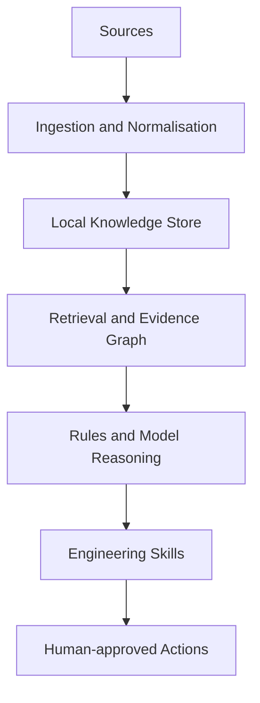
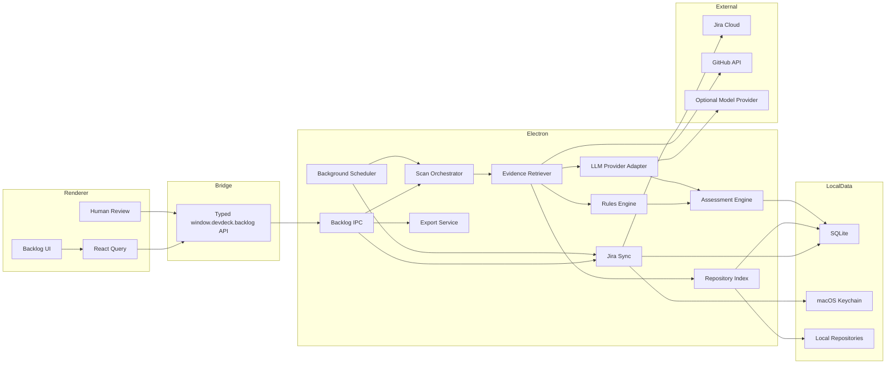
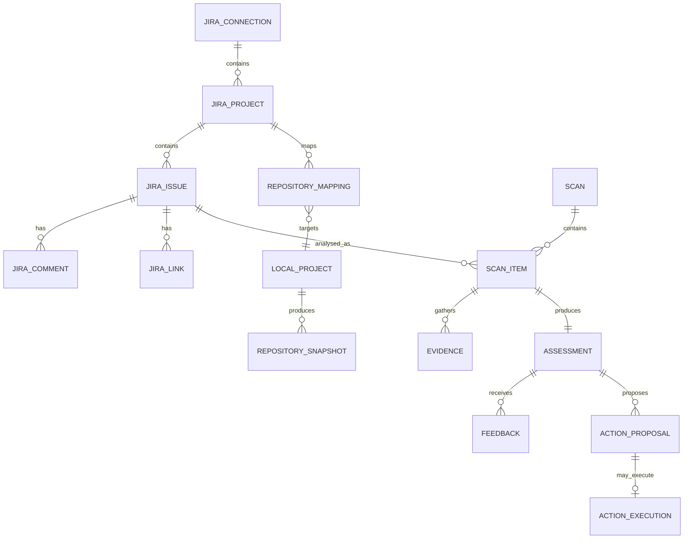
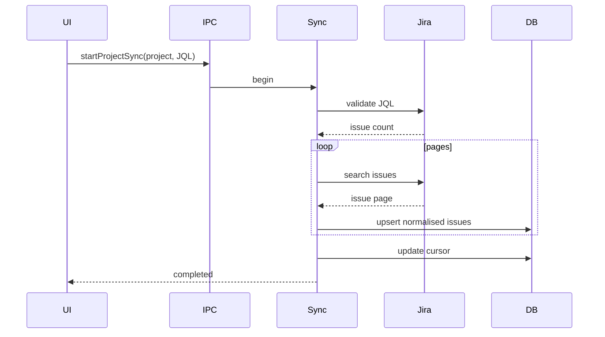
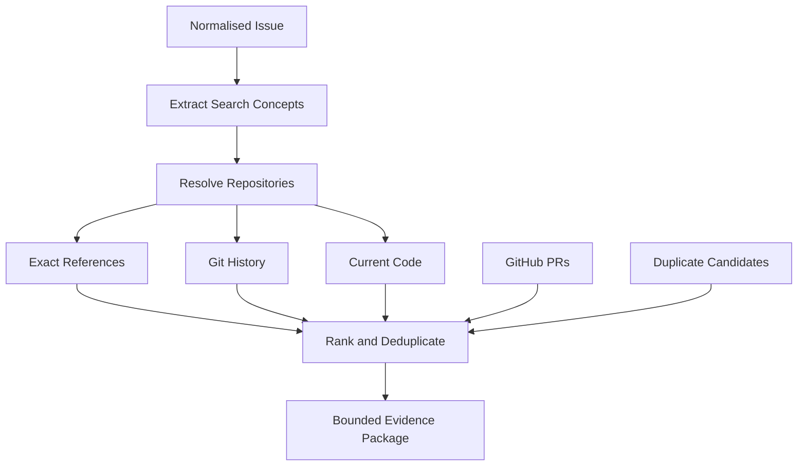

# RFC: DevDeck Engineering Brain

**Status:** Draft for review  
**Authors:** DevDeck maintainers  
**Audience:** Product Engineering, Staff/Principal Engineers, Technical Leadership  
**Target repository:** `ManuelCLopes/DevDeck`  
**Last updated:** 2026-08-02  
**Related document:** `docs/BACKLOG_INTELLIGENCE_INTEGRATION_PLAN.md`

---

## 1. Summary

This RFC proposes evolving DevDeck from a local-first engineering workspace into an extensible **Engineering Brain**: a platform that unifies source code, Git history, GitHub activity, Jira work items, agent workflows, architectural knowledge, and human feedback into a shared local intelligence layer.

Backlog Intelligence is the first major capability built on top of this platform. It will compare Jira backlog items with the real state and history of selected codebases, producing evidence-backed assessments such as:

- possibly implemented;
- partially implemented;
- possibly obsolete;
- possible duplicate;
- needs rewrite;
- valid;
- insufficient evidence.

The platform is intentionally not framed as an autonomous “AI operating system” that takes irreversible actions. It is an engineering decision-support system with strong guarantees around local-first execution, evidence provenance, human approval, least-privilege integrations, bounded model usage, reproducibility, auditability, graceful degradation, and explicit uncertainty.

The recommended first milestone is a read-only **Backlog Health Scan** that analyses a selected Jira backlog against selected local repositories and produces a review queue with evidence, confidence, contradictions, open questions, and suggested actions.

---

## 2. Why this exists

Software organisations accumulate knowledge across disconnected systems:

- Jira describes planned work;
- Git records what changed;
- GitHub describes reviews and merge history;
- source code describes current implementation;
- tests describe intended behaviour;
- architecture documents describe design intent;
- agent traces describe automated execution;
- people remember decisions that were never documented.

These systems drift.

A Jira issue may remain open after its requirement was implemented under a different ticket. A component may have been removed while its backlog remains active. A bug may appear duplicated because multiple teams described the same underlying issue differently. A planned feature may still be relevant, but its description may refer to an architecture that no longer exists.

Traditional backlog tools are not designed to reconcile planned work with the technical state of a codebase. Generic chat interfaces can retrieve information, but often lack stable evidence identity, reproducible scans, confidence calibration, source-specific permissions, longitudinal feedback, and safe write-back.

DevDeck already owns much of the required local execution surface: local repositories, Git operations, GitHub integration, typed Electron IPC, agent workflows, OpenCode sessions, telemetry, and background monitoring. The Engineering Brain extends those capabilities into a coherent intelligence platform.

---

## 3. Product thesis

> Engineering teams need a persistent intelligence layer that understands the relationship between planned work, implementation history, current code, and technical decisions.

The platform should answer questions such as:

- Does this backlog item still describe a real gap?
- Was this issue already implemented indirectly?
- Which pull request changed the behaviour described here?
- Which current files and symbols are relevant?
- Is this issue a duplicate, or only superficially similar?
- Which acceptance criteria are still unmet?
- Which backlog items reference removed services?
- What changed since this issue was last reviewed?
- Which architectural assumptions in this issue are stale?
- Which decisions remain undocumented?

Every answer should include:

1. a bounded conclusion;
2. confidence;
3. explicit evidence;
4. contradictions;
5. open questions;
6. a suggested next action;
7. reproducibility metadata.

---

## 4. Product positioning

DevDeck should not position the Engineering Brain as:

- a replacement for Jira;
- a replacement for engineering leadership;
- an autonomous backlog cleaner;
- a generic “chat with your code” interface;
- a mandatory remote SaaS;
- a self-modifying model system;
- an agent that mutates production systems by default.

Recommended positioning:

> **DevDeck is the local-first engineering intelligence workspace that connects planned work, code, history, and agents.**

Backlog Intelligence is the first skill built on that foundation.

---

## 5. Goals

### Product goals

1. Reduce time spent manually validating stale backlog items.
2. Increase confidence in grooming decisions.
3. Preserve the evidence behind recommendations.
4. Make local code and history first-class context.
5. Reuse one intelligence platform across future skills.
6. Provide measurable quality through human feedback.
7. Preserve privacy and local control.

### Engineering goals

1. Add a modular intelligence domain without destabilising DevDeck.
2. Preserve Electron, renderer, preload, and shared boundaries.
3. Use deterministic evidence before model inference.
4. Support rules-only operation.
5. Make long-running work cancellable.
6. Bind assessments to immutable repository snapshots.
7. Support incremental indexing and synchronisation.
8. Version prompts, schemas, engines, and evidence formats.
9. Avoid a mandatory remote backend.

### Quality goals

1. Zero fabricated evidence references.
2. Zero secrets in logs or exports.
3. Explicit `insufficient_evidence` fallback.
4. Human-reviewable recommendations.
5. Confidence derived from signals, not model self-reporting.
6. Reproducible results for the same inputs and versions.
7. Measurable precision by classification.

---

## 6. Non-goals

The initial programme will not:

- automatically close Jira issues;
- infer business value from code alone;
- determine production rollout success without deployment evidence;
- index all user files;
- provide unrestricted shell execution;
- require cloud-hosted vector storage;
- train a model on customer code;
- replace Jira workflow management;
- automatically prioritise work;
- automatically modify source code;
- guarantee globally complete repository understanding.

---

## 7. Personas

### Tech Lead

Reviews ageing backlog items, identifies cleanup opportunities, prepares grooming sessions, and avoids accidental closure of valid work.

### Staff or Principal Engineer

Needs cross-repository context, architecture history, partial-implementation detection, and safe platform policies.

### Engineering Manager

Needs aggregate backlog health, review throughput, and confidence in cleanup decisions.

### Individual Contributor

Needs fast issue context, related code and history, and a clear path into an implementation investigation.

### Product Manager

Needs technical validation while preserving the boundary between implementation evidence and business decisions.

---

## 8. Core user journeys

### First-time setup

1. Open Backlog.
2. Connect Jira.
3. Store the credential in Keychain.
4. Select a project.
5. Map Jira components to local repositories.
6. Configure JQL.
7. Preview issue count.
8. Synchronise locally.

### Run a scan

1. Select a saved backlog filter.
2. Review selected repositories and HEAD SHAs.
3. Choose rules-only or hybrid mode.
4. Start scan.
5. Collect deterministic evidence.
6. Run rules.
7. Optionally run model synthesis.
8. Persist assessments progressively.
9. Review high-confidence results first.

### Review an issue

1. Open issue details.
2. Inspect Jira content, assessment, and evidence.
3. Open related commit, PR, file, or symbol.
4. Accept, reject, or correct the assessment.
5. Optionally launch OpenCode investigation.

### Revisit after code changes

1. Repository HEAD changes.
2. Relevant assessments are marked stale.
3. New evidence is detected.
4. Run a targeted rescan.
5. Compare old and new results.

### Controlled write-back

1. Review a proposed Jira change.
2. Fetch current Jira state.
3. Detect conflicts.
4. Preview diff.
5. Confirm explicitly.
6. Execute one idempotent action.
7. Store an audit record.

---

## 9. Platform capability model



Shared platform services:

- source connectors;
- credential storage;
- sync cursors;
- normalisation;
- local persistence;
- repository snapshots;
- indexing;
- retrieval;
- evidence ranking;
- provider abstraction;
- redaction;
- scan orchestration;
- evaluation;
- audit;
- human feedback;
- export;
- controlled actions.

Initial skill: **Backlog Intelligence**.

Future skills may include Architecture Drift, Documentation Drift, Technical Debt Intelligence, Incident Intelligence, Release Intelligence, Test Intelligence, Dependency Health, API Evolution, and Agent Intelligence.

---

## 10. Existing DevDeck constraints

The implementation must respect the current architecture:

- renderer code remains under `client/src`;
- preload exposes typed desktop APIs;
- Electron owns native operations, filesystem, Git, credentials, and external calls;
- cross-process contracts live in `shared/`;
- local repositories remain the default code source;
- GitHub enriches local evidence;
- the legacy server is not the primary desktop runtime.

The new domain must not bypass these boundaries.

---

## 11. Target architecture



---

## 12. Architectural invariants

1. Renderer never receives raw credentials.
2. Renderer never executes Git or shell commands.
3. Every evidence item has a stable ID and source reference.
4. Every assessment references evidence IDs that exist.
5. Every assessment belongs to a scan.
6. Every scan records repository HEAD SHAs.
7. Every model call is optional.
8. Rules-only mode remains supported.
9. One failed issue does not fail a scan.
10. Stale assessments are clearly marked.
11. Write-back is a separate permission boundary.
12. Missing evidence does not imply invalidity.
13. Background work obeys user-defined budgets.
14. Repository and Jira text are untrusted model input.

---

## 13. Domain model



Important entities:

- **JiraConnection:** configured Jira site and auth method.
- **JiraProject:** normalised project metadata and sync policy.
- **JiraIssue:** local issue snapshot.
- **RepositoryMapping:** project/component/label/issue to local repositories.
- **RepositorySnapshot:** immutable repository state used by a scan.
- **Scan:** top-level execution and policy boundary.
- **ScanItem:** per-issue execution state.
- **Evidence:** source-backed context.
- **Assessment:** structured classification and recommendation.
- **Feedback:** human evaluation.
- **ActionProposal:** proposed but unapplied mutation.
- **ActionExecution:** audited confirmed mutation.

---

## 14. Core contracts

```ts
export type BacklogClassification =
  | "valid"
  | "possibly_implemented"
  | "partially_implemented"
  | "possibly_obsolete"
  | "possible_duplicate"
  | "needs_rewrite"
  | "insufficient_evidence";

export type SuggestedAction =
  | "keep"
  | "investigate"
  | "rewrite"
  | "link_duplicate"
  | "consider_closing"
  | "split"
  | "no_action";

export interface BacklogAssessment {
  id: string;
  scanId: string;
  issueId: string;
  classification: BacklogClassification;
  confidence: number;
  confidenceBand: "low" | "medium" | "high";
  summary: string;
  rationale: string;
  evidenceIds: string[];
  contradictions: string[];
  openQuestions: string[];
  suggestedAction: SuggestedAction;
  suggestedTitle?: string;
  suggestedDescription?: string;
  engineVersion: string;
  promptVersion?: string;
  repositorySnapshotIds: string[];
  createdAt: string;
}
```

---

## 15. Persistence architecture

### Decision

Use SQLite as the local Engineering Brain store.

Rationale:

- local-first;
- no service dependency;
- relational queries;
- transactions;
- full-text search;
- portable backup;
- suitable for hundreds of thousands to low millions of local rows.

Only Electron accesses the database. The renderer receives DTOs through IPC.

Recommended lifecycle:

1. resolve user-data path;
2. open database;
3. enable WAL and foreign keys;
4. acquire migration lock;
5. back up before destructive migration;
6. run migrations;
7. validate schema version;
8. start services;
9. checkpoint periodically;
10. close gracefully.

The exact SQLite driver must be selected after validating Electron arm64 packaging, code signing, notarisation, testing, and native rebuild requirements.

---

## 16. Source ingestion

### Jira

Ingest project metadata, issue fields, descriptions, comments, links, selected changelog events, workflow transitions, labels, components, and parent relationships.

### Local Git

Derive repository HEAD, branch metadata, commit references, file history, current paths, code snippets, and selected symbols.

### GitHub

Enrich with PR title/body, merge state, review timeline, changed files, CI status, and canonical links.

### Agent traces

Future evidence may include files touched, commands, tests, and task outcome. Agent traces must not be treated as proof of a durable code change unless linked to repository evidence.

---

## 17. Jira synchronisation

### Authentication

Initial implementation uses base URL, email, and API token stored in Keychain. OAuth 2.0 is added later behind an existing credential abstraction.

### Sync metadata

Persist:

- last full sync;
- last incremental sync;
- JQL hash;
- selected-fields hash;
- cursor state;
- last error.

### Full sync



Incremental sync uses Jira update timestamps with a safety overlap window. Periodic full reconciliation detects inaccessible, deleted, or out-of-scope issues without destructive deletion.

Rate limits require bounded concurrency, exponential backoff, jitter, `Retry-After`, cancellation, and visible degraded state.

---

## 18. Repository mapping

Explicit mapping is required because a Jira project may span multiple services, applications, shared libraries, infrastructure, and archived repositories.

```ts
export interface RepositoryMappingRule {
  id: string;
  jiraProjectKey: string;
  match:
    | { type: "project_default" }
    | { type: "component"; value: string }
    | { type: "label"; value: string }
    | { type: "issue"; value: string };
  localProjectIds: string[];
  priority: number;
  enabled: boolean;
}
```

Resolution order:

1. issue override;
2. component;
3. label;
4. project fallback.

The UI must explain the matched rule, selected repositories, unavailable repositories, exclusions, and snapshot IDs.

---

## 19. Repository indexing

### Index tiers

- **Tier 0 — metadata:** repository identity, HEAD, branches, paths, sizes, hashes.
- **Tier 1 — lexical:** issue keys, exact terms, snippets, commit messages.
- **Tier 2 — structural:** symbols, imports, ownership, test relationships.
- **Tier 3 — semantic:** embeddings, clusters, cross-repository concepts.

The MVP implements Tiers 0 and 1. Tier 2 is selective. Tier 3 requires measured need.

Repository fingerprint:

```text
absolute path
+ HEAD SHA
+ indexer version
+ include/exclude policy hash
+ parser configuration hash
```

Use safe process spawning with argument arrays, no shell. Skip binary, generated, dependency, build, secret, and oversized files.

---

## 20. Evidence retrieval



Query classes include issue keys, technical nouns, identifiers, services, endpoints, paths, error messages, versions, and acceptance-criteria concepts.

Evidence ranking considers explicitness, source reliability, temporal relevance, current-state relevance, contradiction value, and context cost.

Every evidence item records source, query, timestamp, repository snapshot, commit SHA, path, excerpt hash, and ranking features.

---

## 21. Rules engine

The rules engine provides value when AI is disabled, unavailable, prohibited, or over budget.

Rule categories:

- implementation evidence;
- obsolescence evidence;
- duplicate evidence;
- stale specification evidence;
- contradiction evidence;
- insufficient evidence.

```ts
export interface AssessmentSignal {
  id: string;
  classification: BacklogClassification;
  category: string;
  score: number;
  weight: number;
  evidenceIds: string[];
  explanation: string;
}
```

Rules produce signals, not absolute truth. Confidence aggregation must be deterministic, versioned, inspectable, and penalise contradictions.

Human feedback may calibrate thresholds only through an explicit versioned change.

---

## 22. Model reasoning layer

The provider layer is model-agnostic.

```ts
export interface ModelProvider {
  id: string;
  capabilities: ModelCapabilities;
  completeStructured<T>(
    request: StructuredCompletionRequest<T>
  ): Promise<StructuredCompletionResult<T>>;
}
```

Policy controls:

- whether AI is enabled;
- allowed provider;
- allowed repositories;
- maximum context;
- token and cost budgets;
- raw-output retention;
- whether code may leave the device.

The prompt must require use of supplied evidence only, citation of evidence IDs, distinction between fact and inference, explicit uncertainty, preservation of contradictions, and bounded recommendations.

Validation includes JSON parsing, Zod schema validation, evidence-ID verification, size limits, and recommendation-policy checks.

On failure: retry once for formatting, then fall back to rules-only and continue the scan.

---

## 23. Human feedback and evaluation

Users can accept, reject, partially accept, correct classification, add notes, identify missing evidence, and mark evidence irrelevant.

A versioned evaluation corpus should contain issue snapshots, repository fixtures, expected evidence, acceptable classifications, forbidden conclusions, and human rationale.

Evaluation dimensions:

- retrieval recall;
- evidence precision;
- classification precision;
- duplicate precision;
- false-obsolete rate;
- hallucinated evidence rate;
- confidence calibration;
- rewrite usefulness;
- cost;
- latency.

New engine and prompt versions should not become default without passing release thresholds.

---

## 24. Action model

All early phases stop at recommendations.

```ts
export interface ActionProposal {
  id: string;
  assessmentId: string;
  actionType:
    | "add_comment"
    | "add_label"
    | "update_description"
    | "link_duplicate"
    | "create_follow_up"
    | "transition_issue";
  preview: unknown;
  requiredPermission: string;
  risk: "low" | "medium" | "high";
  createdAt: string;
}
```

Execution requires explicit confirmation, fresh Jira state, idempotency, action-specific permissions, conflict detection, and an audit record.

Bulk actions require full preview, aggregate summary, second confirmation, bounded execution, and stop-on-conflict policy.

---

## 25. Security model

Protected assets:

- Jira and GitHub credentials;
- model-provider credentials;
- source code;
- Jira content;
- local database;
- exports;
- action audit records.

Threats include credential leakage, prompt injection, malicious repository content, shell injection, path traversal, model exfiltration, stale writes, excessive filesystem access, poisoned evidence, and compromised dependencies.

Treat Jira and repository content as untrusted data. Prompt instructions, policy, issue content, and evidence must be separated clearly. Evidence must never redefine tools, policy, or actions.

Filesystem controls:

- mapped repositories only;
- canonical path resolution;
- traversal prevention;
- symlink policy;
- include/exclude rules;
- no renderer-supplied arbitrary command paths.

Process controls:

- `spawn` with argument arrays;
- no shell;
- timeouts;
- bounded output;
- validated refs and paths;
- child-process cancellation.

Credentials remain in Keychain and are never exposed to the renderer or logs.

---

## 26. Privacy and data residency

By default, synchronised and indexed data stays on the user’s machine.

External model calls are opt-in and policy-controlled. Users can disable AI, choose providers, allow specific repositories, inspect submitted context, exclude paths, delete local data, configure retention, and export audit information.

Diagnostics bundles must be redacted and previewable before sharing.

---

## 27. Observability

Structured logs should include operation ID, scan ID, issue key, stage, duration, error code, and degraded mode without sensitive payloads.

Metrics:

- sync duration;
- issue count;
- index duration;
- retrieval and evidence counts;
- model latency and token usage;
- assessment distribution;
- feedback rate;
- cache hit rate;
- action success rate.

A scan trace should expose sync check, repository snapshot, per-issue retrieval stages, rules, model, and persistence.

Diagnostics UI should show last sync, database health, index health, provider status, failures, stale mappings, and unavailable repositories.

---

## 28. Performance model

Initial scale target:

- 1–10 Jira projects;
- 500–10,000 issues;
- 1–30 repositories;
- 100,000–1,000,000 evidence and index rows.

Budgets:

- incremental sync in seconds to low minutes;
- initial index under a few minutes per medium repository;
- incremental index in seconds;
- rules-only analysis in low seconds per issue;
- hybrid analysis under 20 seconds typical;
- common UI queries under 200 ms.

Use bounded queues for Jira, Git, code search, model calls, and database writes. Background tasks should consider battery, network, app focus, active work, quiet periods, and cost budgets.

---

## 29. Failure model

One failed issue must not fail a scan.

Fatal scan errors include database failure, schema mismatch, invalid policy, or total repository unavailability.

Degraded modes:

- Jira unavailable → local snapshot;
- GitHub unavailable → local Git;
- model unavailable → rules-only;
- one repository unavailable → continue with warning;
- stale index → direct lexical search or partial result.

Retry transient operations only. Do not retry validation or permission errors blindly.

---

## 30. UI architecture

Routes:

```text
/backlog
/backlog/issues
/backlog/issues/:issueId
/backlog/scans
/backlog/scans/:scanId
/backlog/mappings
/backlog/settings
```

Core components:

- backlog summary;
- classification and confidence distributions;
- issue table;
- evidence timeline;
- mapping editor;
- scan progress;
- stale badge;
- contradiction panel;
- rewrite diff;
- feedback controls;
- action preview.

React Query owns desktop data state. Canonical assessments should not be duplicated in localStorage.

Accessibility requires keyboard navigation, semantic tables, labelled indicators, colour-independent states, screen-reader summaries, and focus management.

---

## 31. Agent integration

Add a bounded `backlog-reviewer` agent.

Allowed:

- read issue snapshots;
- search mapped repositories;
- inspect Git history;
- inspect GitHub metadata;
- produce structured evidence;
- launch OpenCode investigation.

Disallowed by default:

- edit Jira;
- edit source;
- push branches;
- merge pull requests;
- arbitrary network access.

Agent traces may enrich history but are not proof of durable code changes unless linked to source evidence.

---

## 32. Background intelligence

Potential triggers:

- scheduled Jira sync;
- repository HEAD change;
- PR merge;
- Jira issue update;
- mapping change;
- policy change;
- manual request.

An assessment becomes stale when issue content, repository state, mapping, engine version, or evidence availability changes.

Targeted invalidation should use issue keys, mappings, changed paths, and previous evidence rather than rescanning everything.

---

## 33. Feature flags and rollout

```ts
export interface BacklogFeatureFlags {
  backlogIntelligenceEnabled: boolean;
  jiraSyncEnabled: boolean;
  rulesAssessmentEnabled: boolean;
  modelAssessmentEnabled: boolean;
  backgroundSyncEnabled: boolean;
  jiraWriteBackEnabled: boolean;
  semanticIndexEnabled: boolean;
}
```

Rollout stages:

1. developer-only;
2. internal alpha;
3. opt-in read-only beta;
4. rules-only public beta;
5. hybrid beta;
6. controlled write-back beta;
7. general availability.

Every high-risk capability requires a kill switch.

---

## 34. Testing strategy

### Unit

Schemas, normalisers, query builders, ranking, rules, confidence, redaction, path policy, and action validation.

### Integration

SQLite, migrations, Jira mock, Git fixtures, GitHub adapter, IPC, provider mock, Keychain abstraction, and cancellation.

### E2E

Onboarding, sync, mapping, scan, issue review, feedback, export, degraded operation, and write-back preview.

### Golden evaluation

Each fixture includes issue data, repository state, expected evidence, acceptable outcomes, and forbidden conclusions.

### Security

Secret redaction, path traversal, symlink escape, shell injection, prompt injection, credential exposure, replay, and stale-write conflict.

### Release

Type check, unit tests, E2E, package smoke test, release preflight, and signed app validation.

---

## 35. Phased roadmap

### Phase 0 — Architecture and validation

Deliver ADRs, threat model, SQLite spike, Jira mock, Git fixtures, UX wireframes, evaluation corpus, and packaging validation.

### Phase 1 — Domain and storage

**Status (2026-08-18): implemented** — shared contracts and schemas, the SQLite lifecycle/migration runner/schema v1, the Engineering Brain operation service, IPC, the typed preload bridge, feature flags, and the disabled-by-default Backlog shell UI. See docs/BACKLOG_INTELLIGENCE_INTEGRATION_PLAN.md's Phase 1 section for the file-by-file breakdown and the one open item (macOS packaging/signing/notarisation validation, tracked in ADR-0003).

Deliver shared contracts, schemas, SQLite, migrations, IPC, Backlog shell UI, and feature flags.

### Phase 2 — Jira read-only

**Status (2026-08-27): implemented, validated only against a mocked Jira API** — this environment has no live Jira Cloud site to sync against. See docs/BACKLOG_INTELLIGENCE_INTEGRATION_PLAN.md's Phase 2 section for the file-by-file breakdown and what's still deferred (guided filters, issue-detail drill-down, live-scale validation).

Deliver authentication, Keychain, project discovery, JQL, full and incremental sync, and issue browsing.

### Phase 3 — Repository evidence

**Status (2026-08-27): implemented** — repository mapping precedence, the safe Git runner, ripgrep/Node lexical search, GitHub PR search, evidence persistence, and an issue-detail evidence panel. See docs/BACKLOG_INTELLIGENCE_INTEGRATION_PLAN.md's Phase 3 section for what's deferred (component-removal detection, a persisted incremental index, full evidence ranking).

Deliver mappings, snapshots, Git search, code search, GitHub enrichment, and evidence UI.

### Phase 4 — Rules-only assessment

Deliver scan orchestration, signals, confidence, assessments, review workflow, feedback, and exports.

This is the first release with standalone value.

### Phase 5 — Hybrid model reasoning

Deliver provider abstraction, policies, redaction, structured output, evaluation, and rewrite suggestions.

This is the first strongly differentiated release.

### Phase 6 — Operational grooming

Deliver high-throughput queues, scan comparison, saved views, OpenCode handoff, keyboard UX, and accessibility.

This is the first team-routine release.

### Phase 7 — Controlled actions

Deliver comments, labels, description updates, duplicate links, follow-up issue creation, and audit.

### Phase 8 — Continuous intelligence

Deliver scheduled sync, targeted invalidation, merge-triggered reanalysis, notifications, and cost controls.

### Phase 9 — Semantic and graph capabilities

Add embeddings, structural graph, semantic retrieval, clustering, and drift analysis only after measured need.

### Phase 10 — Hardening

Deliver OAuth, backup/restore, repair, retention, diagnostics, enterprise policy, security review, and migration documentation.

---

## 36. Suggested quarterly delivery

### Quarter 1

- Phase 0;
- Phase 1;
- Phase 2;
- begin Phase 3.

### Quarter 2

- complete Phase 3;
- Phase 4;
- internal read-only beta;
- quality tuning.

### Quarter 3

- Phase 5;
- Phase 6;
- opt-in external beta;
- performance and onboarding refinement.

### Quarter 4

- Phase 7;
- Phase 8;
- controlled write-back beta;
- OAuth and hardening.

Semantic indexing should not receive a committed date until metrics demonstrate a retrieval gap.

---

## 37. Team topology

Suggested ownership:

- **Platform lead:** architecture, persistence, IPC, security, release integration.
- **Integrations engineer:** Jira, GitHub, auth, sync, rate limiting.
- **Retrieval engineer:** Git, code search, indexing, evidence ranking.
- **Product engineer:** Backlog UI, mapping, scans, feedback.
- **AI/evaluation engineer:** providers, prompts, schemas, corpus, calibration.

Roles may overlap on a small team, but ownership boundaries should remain explicit.

---

## 38. Required ADRs

1. Use SQLite for Engineering Brain persistence.
2. Keep Electron as sole native and database owner.
3. Start Jira with API-token auth while preserving OAuth abstraction.
4. Keep the MVP read-only.
5. Use deterministic retrieval before model reasoning.
6. Support rules-only operation indefinitely.
7. Bind assessments to repository snapshots.
8. Do not introduce embeddings in the MVP.
9. Require structured model output with evidence validation.
10. Store credentials in Keychain.
11. Treat Jira and repository content as untrusted prompt input.
12. Separate recommendations from actions.
13. Use explicit repository mapping.
14. Preserve scan history and human feedback.
15. Mark assessments stale rather than silently replacing them.

---

## 39. Open questions

1. Which SQLite driver offers the best packaging trade-off?
2. Should all Jira comments be synchronised?
3. How much changelog history is needed initially?
4. Should GitHub review comments be indexed by default?
5. Which languages receive symbol parsing first?
6. What is the default external-model data policy?
7. How should provider credentials be configured?
8. How much raw model output should be retained?
9. How should ownership influence ranking?
10. What precision threshold is required for `possibly_obsolete`?
11. Should duplicate detection initially stay within one Jira project?
12. How should monorepos be mapped?
13. What is the default evidence-retention period?
14. Should scans resume after restart?
15. Which actions are low-risk enough for first write-back?

---

## 40. Primary risks

| Risk | Mitigation |
|---|---|
| Overclaiming | Conservative language, evidence, uncertainty |
| Native SQLite packaging | Validate in Phase 0 |
| False positives | Rules-first, thresholds, evaluation, feedback |
| Code exfiltration | Local-first, policy, redaction, allowlists |
| Expensive scans | Incremental indexing, cache, budgets |
| Jira complexity | Adapter, mock service, contract tests |
| Too much evidence | Ranking, summaries, progressive disclosure |
| Invalid model output | Structured validation and fallback |
| Stale Jira writes | Optimistic locking and fresh-state checks |

---

## 41. First public beta acceptance criteria

1. Jira Cloud read-only connection works reliably.
2. Credentials remain in Keychain.
3. Users can map projects to local repositories.
4. Users can synchronise and browse issues offline.
5. A rules-only scan analyses at least 500 issues.
6. Every assessment includes valid evidence or `insufficient_evidence`.
7. Failures are isolated.
8. Assessments are bound to repository HEAD SHAs.
9. Users can accept, reject, or correct assessments.
10. Results can be exported.
11. No Jira mutation exists.
12. No secrets appear in logs or exports.
13. Type check, tests, E2E, build, and packaging pass.
14. Evaluation precision meets approved thresholds.
15. Unsupported definitive claims are absent from the UX.

---

## 42. Long-term evolution

Once Backlog Intelligence validates the platform, the same primitives can support:

- **Architecture Drift:** compare current code with ADRs and boundaries.
- **Documentation Drift:** detect docs that no longer match implementation.
- **Technical Debt Intelligence:** group stale TODOs, ownership gaps, and maintenance patterns.
- **Release Intelligence:** explain changes, affected work, and remaining risk.
- **Incident Intelligence:** connect incidents to commits, PRs, and similar failures.
- **Test Intelligence:** identify missing or stale tests around planned work.
- **API Evolution:** track endpoint, schema, and consumer changes.
- **Agent Intelligence:** measure durable engineering outcomes rather than token volume alone.

These capabilities should reuse the shared platform instead of becoming disconnected AI features.

---

## 43. Recommended decision

Approve the Engineering Brain architecture and proceed with Backlog Intelligence as the first skill.

Begin with Phases 0–4:

1. validate architecture and packaging;
2. introduce local persistence and contracts;
3. integrate Jira read-only;
4. collect deterministic repository evidence;
5. deliver a rules-only Backlog Health Scan.

Only after quality is measured should the project introduce model-assisted synthesis, controlled Jira write-back, continuous background intelligence, or semantic indexing.

---

## 44. Final principle

The Engineering Brain should not optimise for sounding intelligent.

It should optimise for making engineering decisions safer, faster, and easier to verify.

That means:

- evidence over confidence theatre;
- bounded claims over definitive language;
- reproducibility over novelty;
- local control over hidden infrastructure;
- human review over autonomous mutation;
- shared platform primitives over disconnected AI features.
