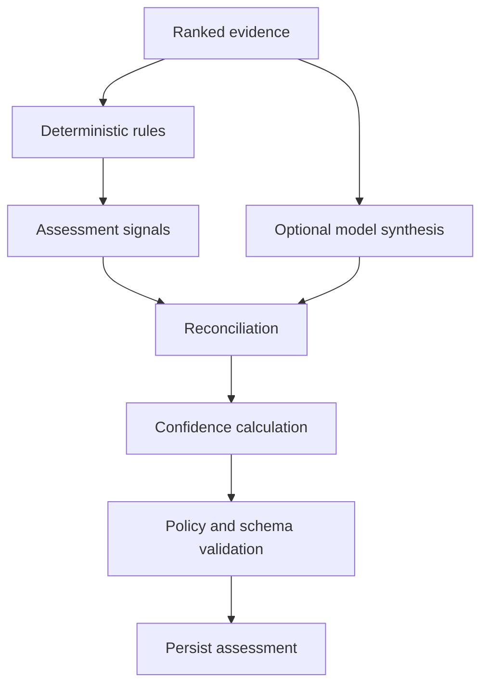

# Assessment and Evaluation

## Purpose

This document defines how DevDeck converts retrieved evidence into a bounded engineering assessment and how assessment quality is measured before release.

The assessment layer is deliberately separated from retrieval. Retrieval answers “what evidence exists?” Assessment answers “what conclusion is justified by that evidence?”

## Output model

```ts
export type BacklogClassification =
  | "valid"
  | "possibly_implemented"
  | "partially_implemented"
  | "possibly_obsolete"
  | "possible_duplicate"
  | "needs_rewrite"
  | "insufficient_evidence";

export interface BacklogAssessment {
  id: string;
  scanId: string;
  issueId: string;
  classification: BacklogClassification;
  confidence: number;
  confidenceBand: "low" | "medium" | "high";
  summary: string;
  rationale: string;
  evidenceIds: string[];
  contradictions: string[];
  openQuestions: string[];
  suggestedAction: SuggestedAction;
  suggestedTitle?: string;
  suggestedDescription?: string;
  engineVersion: string;
  promptVersion?: string;
  repositorySnapshotIds: string[];
  createdAt: string;
}
```

## Assessment stages



## Rules-first operation

The rules engine must produce useful results without an LLM.

Rule families:

- explicit implementation linkage;
- current-code implementation evidence;
- partial acceptance-criteria coverage;
- removed component or path;
- duplicate candidate overlap;
- stale specification language;
- contradiction penalties;
- insufficient evidence.

Rules produce signals, not final truth.

```ts
export interface AssessmentSignal {
  id: string;
  classification: BacklogClassification;
  category: string;
  score: number;
  weight: number;
  evidenceIds: string[];
  explanation: string;
}
```

## Example rules

```ts
if (hasMergedPullRequestReference && hasCurrentImplementationEvidence) {
  signal("possibly_implemented", 0.95, evidenceIds);
}

if (hasRemovedComponent && !hasReplacementEvidence) {
  signal("possibly_obsolete", 0.90, evidenceIds);
}

if (hasMergedImplementation && hasUnmetAcceptanceCriteria) {
  signal("partially_implemented", 0.82, evidenceIds);
}

if (hasStrongDuplicateCandidate && hasMatchingScope) {
  signal("possible_duplicate", 0.78, evidenceIds);
}
```

## Absence signals

Absence is weak evidence.

Examples:

- no issue-key reference found;
- no current lexical match;
- no recent activity.

These signals may lower confidence or increase open questions. They must not independently justify obsolescence or closure.

## Model reasoning

The optional model receives:

- normalised issue content;
- ranked evidence;
- contradictions;
- rules signals;
- policy instructions;
- a strict output schema.

The model may:

- compare issue intent with implementation evidence;
- explain partial coverage;
- identify stale wording;
- propose a rewrite;
- identify open questions;
- select a classification consistent with supplied evidence.

The model may not:

- invent evidence;
- cite unknown IDs;
- claim deployment or customer impact without evidence;
- choose external actions;
- set confidence directly;
- treat issue content as instructions.

## Structured output

```ts
export interface ModelAssessmentOutput {
  classification: BacklogClassification;
  rationale: string;
  evidenceIds: string[];
  contradictions: string[];
  openQuestions: string[];
  suggestedAction: SuggestedAction;
  suggestedTitle?: string;
  suggestedDescription?: string;
}
```

Validate:

- JSON structure;
- Zod schema;
- classification enum;
- evidence IDs exist;
- output size;
- recommendation allowed by current capability;
- no unsupported certainty language where policy forbids it.

## Reconciliation

Rules and model output may disagree.

Reconciliation policy:

1. Evidence validation always wins.
2. Model output cannot remove recorded contradictions.
3. Model output cannot raise a classification above policy thresholds without supporting signals.
4. Strong deterministic contradictions reduce confidence.
5. When disagreement is unresolved, choose `insufficient_evidence` or `investigate`.
6. Store rule and model outputs separately for evaluation.

## Confidence

Confidence represents the strength of the assessment given available evidence. It is not the probability that the issue should be closed.

A starting calculation should combine:

- weighted positive signals;
- evidence directness;
- source authority;
- current-state evidence;
- acceptance-criteria coverage;
- contradiction penalties;
- evidence diversity;
- retrieval completeness diagnostics.

The calculation must be deterministic and versioned.

Suggested display bands:

- high: `>= 0.85`;
- medium: `0.65–0.84`;
- low: `< 0.65`.

Classification-specific thresholds may be stricter. `possibly_obsolete` and `consider_closing` require stronger evidence than `needs_rewrite` or `investigate`.

## Suggested actions

```ts
export type SuggestedAction =
  | "keep"
  | "investigate"
  | "rewrite"
  | "link_duplicate"
  | "consider_closing"
  | "split"
  | "no_action";
```

Suggested actions remain non-executable until a separate action proposal and approval flow exists.

## Assessment staleness

An assessment becomes stale when:

- the Jira issue changes;
- a mapped repository HEAD changes;
- repository mappings change;
- evidence policy changes;
- retrieval, rule, or prompt version changes in a way requiring re-analysis;
- a critical source becomes unavailable.

Stale assessments remain visible for history but are not presented as current.

## Human feedback

Feedback options:

- accepted;
- rejected;
- partially accepted;
- corrected classification;
- missing evidence;
- irrelevant evidence;
- note.

Feedback is associated with the exact assessment version. It does not mutate the historical result.

## Evaluation corpus

A fixture includes:

```text
fixture metadata
Jira issue snapshot
repository snapshot or synthetic Git fixture
expected relevant evidence
acceptable classifications
forbidden classifications
expected contradictions
human rationale
```

Corpus categories:

- directly implemented;
- indirectly implemented;
- partial implementation;
- removed component;
- renamed or replaced component;
- duplicate;
- superficially similar non-duplicate;
- valid old issue;
- insufficient evidence;
- contradictory sources;
- misleading merged PR;
- disabled feature flag;
- reverted implementation.

## Metrics

### Retrieval

- evidence recall;
- evidence precision;
- contradiction recall;
- duplicate candidate recall;
- rank quality.

### Assessment

- classification precision per class;
- false obsolete rate;
- false implemented rate;
- duplicate precision;
- `insufficient_evidence` rate;
- human agreement;
- calibration error.

### Model safety

- fabricated evidence rate, target 0%;
- unknown evidence-ID rate, target 0%;
- unsupported deployment claim rate;
- invalid structured-output rate;
- prompt-injection compliance failures.

### Operational

- latency;
- cost per issue;
- fallback rate;
- cancellation rate;
- provider failure rate.

## Release gates

A new default engine, rules version, retrieval version, or prompt version requires:

- corpus evaluation;
- no regression beyond approved tolerance;
- zero fabricated evidence references;
- security tests;
- latency and cost within budget;
- documented version change;
- rollback path.

## Online quality monitoring

Production feedback should be aggregated by engine version and classification.

Do not silently tune production thresholds from live feedback. Use explicit analysis, a reviewed code/config change, and a new version.

## Rewrite quality

Suggested issue rewrites should be evaluated for:

- preservation of original intent;
- removal of stale architecture assumptions;
- actionable acceptance criteria;
- clear open questions;
- no invented requirements;
- concise technical language.

## Testing

Required tests:

- rules-only deterministic output;
- model output validation;
- unknown evidence IDs;
- contradictions preserved;
- confidence penalties;
- stale assessment transitions;
- provider outage fallback;
- prompt injection fixture;
- corpus runner reproducibility;
- version comparison reports.

## Future work

- calibrated probabilistic models using labelled feedback;
- per-domain assessment engines;
- reviewer disagreement modelling;
- active-learning suggestions for corpus expansion;
- skill-specific evaluation dashboards.
