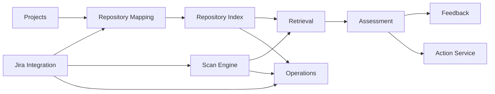

# Domain and API Specifications

## Purpose

This document defines the initial domain boundaries and public desktop contracts for the Engineering Brain platform and Backlog Intelligence skill.

The interfaces are architectural targets. Implementation may refine field names through reviewed contract changes, but ownership and safety boundaries should remain stable.

## Domain map



## Source integration domain

### Jira connection

```ts
export type JiraAuthenticationType = "api_token" | "oauth";

export interface JiraConnectionSummary {
  id: string;
  baseUrl: string;
  accountEmail: string | null;
  authenticationType: JiraAuthenticationType;
  status: "connected" | "degraded" | "invalid" | "unknown";
  lastSuccessfulSyncAt: string | null;
}

export interface SaveJiraConnectionInput {
  id?: string;
  baseUrl: string;
  accountEmail: string;
  authenticationType: "api_token";
  apiToken: string;
}
```

The secret exists only in the command input crossing the preload boundary into Electron and is immediately stored in Keychain. It is never persisted or returned.

### Jira project

```ts
export interface JiraProjectSummary {
  id: string;
  connectionId: string;
  key: string;
  name: string;
  enabled: boolean;
  lastSyncedAt: string | null;
}
```

### Jira issue

```ts
export interface JiraIssueSnapshot {
  id: string;
  connectionId: string;
  externalId: string;
  key: string;
  projectKey: string;
  issueType: string;
  status: string;
  summary: string;
  description: string | null;
  components: string[];
  labels: string[];
  parentKey: string | null;
  createdAt: string;
  updatedAt: string;
  syncedAt: string;
  sourceVersion: string | null;
}
```

## Repository mapping domain

```ts
export type RepositoryMappingMatcher =
  | { type: "project_default" }
  | { type: "component"; value: string }
  | { type: "label"; value: string }
  | { type: "issue"; value: string };

export interface RepositoryMapping {
  id: string;
  jiraProjectKey: string;
  matcher: RepositoryMappingMatcher;
  localProjectIds: string[];
  priority: number;
  enabled: boolean;
}
```

Resolution returns diagnostics:

```ts
export interface ResolvedRepositoryScope {
  issueId: string;
  matchedRuleIds: string[];
  projectIds: string[];
  unavailableProjectIds: string[];
  warnings: string[];
}
```

## Repository snapshot domain

```ts
export interface RepositorySnapshot {
  id: string;
  projectId: string;
  repositoryPath: string;
  headSha: string;
  defaultBranch: string | null;
  fingerprint: string;
  policyHash: string;
  indexerVersion: string;
  status: "staging" | "ready" | "failed" | "cancelled" | "stale";
  createdAt: string;
  completedAt: string | null;
}
```

## Evidence domain

```ts
export type EvidenceKind =
  | "jira_field"
  | "jira_comment"
  | "jira_history"
  | "jira_link"
  | "git_commit"
  | "github_pull_request"
  | "code_file"
  | "code_symbol"
  | "test"
  | "migration"
  | "configuration"
  | "documentation"
  | "component_removed"
  | "repository_activity"
  | "agent_trace";

export interface EngineeringEvidence {
  id: string;
  scanItemId: string;
  kind: EvidenceKind;
  title: string | null;
  excerpt: string | null;
  filePath: string | null;
  symbol: string | null;
  strength: "low" | "medium" | "high";
  sourceReference: SourceReference;
  repositorySnapshotId: string | null;
  metadata: Record<string, unknown>;
  collectedAt: string;
  collectorVersion: string;
}
```

## Scan domain

```ts
export type BacklogScanStatus =
  | "pending"
  | "running"
  | "completed"
  | "failed"
  | "cancelled";

export interface BacklogScan {
  id: string;
  jiraProjectKey: string;
  issueIds: string[];
  repositorySnapshotIds: string[];
  status: BacklogScanStatus;
  mode: "rules_only" | "hybrid";
  engineVersion: string;
  retrievalVersion: string;
  promptVersion: string | null;
  createdAt: string;
  completedAt: string | null;
}

export interface StartBacklogScanInput {
  jiraProjectKey: string;
  issueIds?: string[];
  savedFilterId?: string;
  mode: "rules_only" | "hybrid";
  forceRepositoryRefresh?: boolean;
}
```

Exactly one of `issueIds` or `savedFilterId` should be supplied.

## Assessment domain

```ts
export type BacklogClassification =
  | "valid"
  | "possibly_implemented"
  | "partially_implemented"
  | "possibly_obsolete"
  | "possible_duplicate"
  | "needs_rewrite"
  | "insufficient_evidence";

export interface BacklogAssessmentSummary {
  id: string;
  scanId: string;
  issueId: string;
  classification: BacklogClassification;
  confidence: number;
  confidenceBand: "low" | "medium" | "high";
  suggestedAction: SuggestedAction;
  evidenceCount: number;
  contradictionCount: number;
  stale: boolean;
  createdAt: string;
}

export interface BacklogAssessmentDetail extends BacklogAssessmentSummary {
  summary: string;
  rationale: string;
  evidence: EngineeringEvidence[];
  contradictions: string[];
  openQuestions: string[];
  suggestedTitle: string | null;
  suggestedDescription: string | null;
  ruleSignals: AssessmentSignal[];
  repositorySnapshotIds: string[];
}
```

## Feedback domain

```ts
export type AssessmentFeedbackVerdict =
  | "accepted"
  | "partially_accepted"
  | "rejected";

export interface SubmitAssessmentFeedbackInput {
  assessmentId: string;
  verdict: AssessmentFeedbackVerdict;
  correctedClassification?: BacklogClassification;
  note?: string;
  missingEvidence?: string;
  irrelevantEvidenceIds?: string[];
}
```

Feedback creates a new immutable record. It does not modify the assessment.

## Action domain

```ts
export type JiraActionType =
  | "add_comment"
  | "add_label"
  | "update_description"
  | "link_duplicate"
  | "create_follow_up"
  | "transition_issue";

export interface ActionProposal {
  id: string;
  assessmentId: string;
  targetIssueId: string;
  actionType: JiraActionType;
  risk: "low" | "medium" | "high";
  preview: Record<string, unknown>;
  requiredPermission: string;
  targetVersion: string | null;
  createdAt: string;
}
```

No action execution API is exposed until the controlled write-back milestone.

## Desktop API

```ts
export interface BacklogDesktopApi {
  listJiraConnections(): Promise<JiraConnectionSummary[]>;
  saveJiraConnection(input: SaveJiraConnectionInput): Promise<JiraConnectionSummary>;
  testJiraConnection(id: string): Promise<JiraConnectionHealth>;
  deleteJiraConnection(id: string): Promise<void>;

  listJiraProjects(connectionId: string): Promise<JiraProjectSummary[]>;
  previewJql(input: PreviewJqlInput): Promise<JqlPreview>;
  startJiraSync(input: StartJiraSyncInput): Promise<EngineeringBrainOperation>;

  listRepositoryMappings(projectKey: string): Promise<RepositoryMapping[]>;
  saveRepositoryMappings(input: SaveRepositoryMappingsInput): Promise<RepositoryMapping[]>;
  resolveRepositoryScope(issueId: string): Promise<ResolvedRepositoryScope>;

  listIssues(input: ListBacklogIssuesInput): Promise<BacklogIssuePage>;
  getIssue(id: string): Promise<BacklogIssueDetail | null>;

  startScan(input: StartBacklogScanInput): Promise<EngineeringBrainOperation>;
  getScan(id: string): Promise<BacklogScan | null>;
  listScans(input?: ListBacklogScansInput): Promise<BacklogScan[]>;

  getAssessment(id: string): Promise<BacklogAssessmentDetail | null>;
  listAssessments(input: ListAssessmentsInput): Promise<BacklogAssessmentPage>;
  submitFeedback(input: SubmitAssessmentFeedbackInput): Promise<void>;

  exportReport(input: ExportBacklogReportInput): Promise<ExportResult>;
}
```

## Pagination

Use cursor or stable offset pagination according to storage query needs, but public DTOs should use one consistent contract:

```ts
export interface Page<T> {
  items: T[];
  nextCursor: string | null;
  total: number | null;
}
```

Cursors are opaque to the renderer.

## Filtering

Issue and assessment list filters may include:

- project;
- Jira status;
- issue type;
- component;
- classification;
- confidence band;
- stale/current;
- reviewed/unreviewed;
- scan;
- age and update ranges.

Filters require bounded arrays and validated sort fields.

## Events

```ts
export type BacklogEvent =
  | { type: "jira-sync-progress"; operationId: string; completed: number; total: number | null }
  | { type: "repository-index-progress"; operationId: string; projectId: string; progress: number }
  | { type: "scan-progress"; operationId: string; scanId: string; completed: number; total: number }
  | { type: "assessment-created"; scanId: string; assessmentId: string }
  | { type: "assessment-stale"; assessmentId: string; reason: string };
```

Events trigger canonical refetch rather than replacing stored state blindly.

## Versioning

Version independently:

- database schema;
- shared DTO schema where compatibility matters;
- retrieval engine;
- indexer;
- rules engine;
- prompt;
- model output schema;
- export format.

Persist the versions required to reconstruct an assessment.

## Error contracts

```ts
export interface PublicError {
  code: string;
  message: string;
  retryable: boolean;
  details?: Record<string, string | number | boolean | null>;
}
```

Error details must remain safe and stable enough for UI decisions.

## Validation rules

- validate all IPC command input at runtime;
- cap string and array sizes;
- reject arbitrary filesystem paths;
- reject unknown classifications and action types;
- require identifiers to refer to authorised configured entities;
- ensure evidence IDs belong to the assessment or scan being referenced;
- ensure policy allows hybrid mode before starting it.

## Ownership summary

- Jira integration owns external snapshots and cursors.
- Mapping owns issue-to-repository scope.
- Indexing owns derived repository records.
- Retrieval owns evidence discovery and ranking.
- Assessment owns conclusions and confidence.
- Feedback owns human labels.
- Actions own mutation proposals and execution.
- Operations own lifecycle and cancellation.

## Compatibility policy

Additive DTO changes are preferred. Breaking preload APIs require coordinated shared, preload, Electron, renderer, and test updates in one pull request.

Persisted schema changes require migrations. Historical assessments are not rewritten merely because a newer engine exists.

## Follow-up specifications

Implementation should add focused documents or code comments for:

- Jira field normalisation;
- Atlassian Document Format conversion;
- repository file and symbol schemas;
- confidence algorithm version 1;
- export schemas;
- action conflict semantics.
