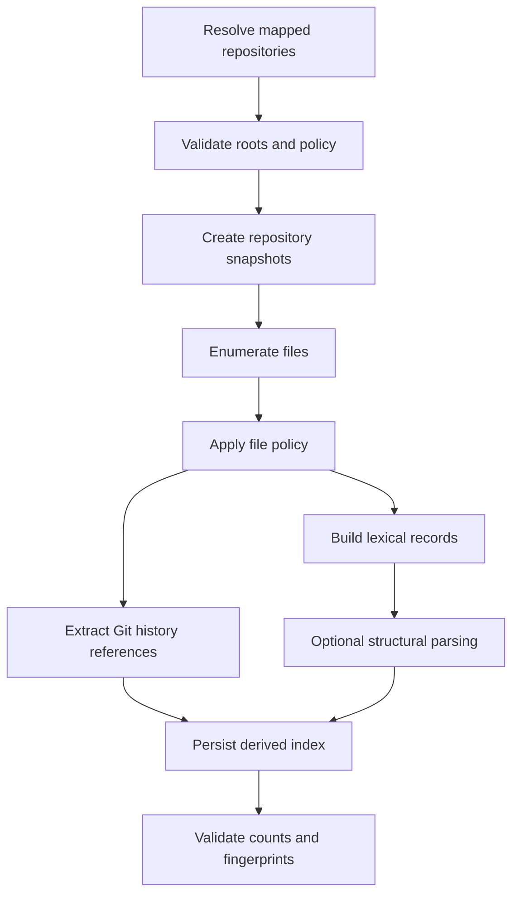

# Indexing Pipeline

## Purpose

The indexing pipeline turns selected local repositories into bounded, reproducible, searchable snapshots for Engineering Brain skills.

The index is not intended to model every semantic property of a codebase. It provides enough structure to support deterministic evidence retrieval before model reasoning.

## Principles

1. Repository access is explicit.
2. Every index is bound to a repository snapshot.
3. Incremental work is preferred.
4. Lexical and historical evidence comes before embeddings.
5. Sensitive and generated content is excluded by policy.
6. Indexes are derived and rebuildable.
7. Indexing never blocks the renderer thread.

## Index tiers

### Tier 0 — Repository metadata

- DevDeck project ID;
- absolute repository path;
- canonical path;
- default branch;
- HEAD SHA;
- remotes;
- worktree state summary;
- index policy hash;
- indexer version.

### Tier 1 — Lexical index

- file paths;
- file extension/language;
- content hash;
- bounded searchable text;
- issue-key references;
- exact identifiers;
- commit messages;
- changed-file metadata.

### Tier 2 — Structural index

- symbols;
- symbol kind;
- parent symbol;
- imports and exports;
- test/source associations;
- ownership hints;
- API routes;
- configuration keys.

Tier 2 should be introduced language by language and only where evaluation proves value.

### Tier 3 — Semantic index

- embeddings;
- conceptual clusters;
- cross-repository semantic links.

Tier 3 is explicitly deferred until lexical retrieval misses are measured.

## Snapshot identity

```text
snapshot fingerprint =
  canonical repository path
  + HEAD SHA
  + indexer version
  + include/exclude policy hash
  + parser configuration hash
```

A dirty working tree is recorded separately. The default backlog analysis snapshot should use committed state. A future explicit mode may include working-tree changes.

## Pipeline



## Repository validation

Before indexing:

- canonicalise the path;
- confirm it is a directory;
- confirm it is a Git repository;
- reject path traversal outside approved roots;
- apply symlink policy;
- confirm the project mapping is enabled;
- confirm the repository is not already indexed by an equivalent active operation.

## File enumeration

Prefer Git-aware enumeration to avoid indexing ignored or untracked generated content unintentionally.

Candidate commands:

```bash
git ls-files -c -o --exclude-standard
git ls-tree -r --name-only HEAD
```

The exact command depends on whether the selected mode includes untracked files.

## Default file policy

Exclude:

```text
.git/**
node_modules/**
vendor/**
dist/**
build/**
coverage/**
.next/**
*.min.js
*.map
*.lock where content is not needed
.env*
*.pem
*.key
*.p12
*.jks
secrets/**
credentials/**
```

Also exclude:

- binaries;
- files above a configurable size;
- generated files detected by path or header;
- user-defined deny patterns.

Allow users to add project-specific include and exclude patterns.

## Content handling

Do not retain entire source files by default.

Persist:

- hashes;
- searchable bounded chunks or FTS content;
- exact line ranges for evidence;
- symbol metadata;
- source path and snapshot reference.

The canonical source remains the repository itself.

## Chunking

Lexical chunks should preserve useful boundaries:

- file-level for small configuration and documentation files;
- symbol-level when parsers are available;
- bounded line windows around matches;
- heading sections for Markdown.

Chunks require stable IDs derived from snapshot, path, range, and content hash.

## Issue-key extraction

Extract configured Jira key patterns from:

- commit messages;
- branch names;
- file content;
- comments;
- tests;
- documentation.

Pattern matching must avoid treating arbitrary uppercase tokens as Jira keys. Patterns should be learned from configured project keys.

## Git history extraction

Index or query:

- commits referencing issue keys;
- commits changing matched terms;
- file rename history;
- file deletion history;
- merge commits;
- authorship and timestamps.

Use direct Git queries for deep history rather than copying the complete commit graph into SQLite unless profiling demonstrates the need.

## Structural parsing

Parser adapters implement:

```ts
export interface SymbolExtractor {
  supports(path: string): boolean;
  extract(input: SymbolExtractionInput): Promise<SymbolRecord[]>;
}
```

Initial candidates:

- TypeScript compiler API for TypeScript/JavaScript;
- Tree-sitter for selected additional languages;
- no-op fallback.

Parser failure must not fail lexical indexing.

## Incremental indexing

### No HEAD change

Reuse the index when fingerprint inputs are unchanged.

### HEAD changed

Use Git diff between the previous and current snapshot to determine:

- added files;
- modified files;
- deleted files;
- renamed files.

Re-index only affected records and references.

### Policy or indexer changed

Run a policy-aware rebuild. Preserve old snapshot metadata until the new index completes successfully.

## Atomicity

An index build writes into a staging snapshot state.

Only mark a snapshot `ready` after:

- all required stages complete;
- counts are validated;
- no fatal policy violation occurs.

Failed or cancelled snapshots are not used by scans.

## Operation states

```text
pending
validating
snapshotting
enumerating
indexing_lexical
indexing_history
indexing_structural
persisting
ready
failed
cancelled
```

## Cancellation

Indexing must propagate `AbortSignal` to:

- filesystem enumeration;
- Git subprocesses;
- parsers;
- persistence batches.

Cancellation cleans staging data but preserves the previous ready snapshot.

## Concurrency

Suggested initial limits:

- two repositories indexed concurrently;
- bounded file-processing workers;
- serialised database write batches;
- one active index per repository and configuration fingerprint.

## Resource budgets

Configurable limits:

- maximum file size;
- maximum total indexed bytes;
- maximum chunk size;
- maximum Git output;
- maximum parser time per file;
- maximum operation duration.

A budget breach produces a partial or failed index with an explicit diagnostic; it must not silently omit arbitrary data.

## Staleness

A ready snapshot becomes stale when:

- repository HEAD changes;
- mapping changes;
- index policy changes;
- indexer version changes;
- repository path becomes unavailable.

Staleness is distinct from invalidity. A stale snapshot may remain viewable but should not be used for a current scan without an explicit degraded-mode decision.

## Observability

Record:

- repository ID and snapshot ID;
- file counts by outcome;
- bytes processed;
- excluded paths by rule;
- Git command duration;
- parser errors;
- cache hits;
- total duration;
- cancellation and failure stage.

Do not log source content.

## Testing

Required fixtures:

- small TypeScript repository;
- monorepo;
- repository with renames and deletions;
- binary and generated files;
- secrets and denied paths;
- symlink escape attempt;
- large file;
- dirty worktree;
- cancellation;
- incremental HEAD update.

## Future work

- semantic index;
- ownership graph;
- build-system-aware module graph;
- language-server integration;
- remote repository snapshots when no local clone exists;
- worktree-aware temporary analysis.
