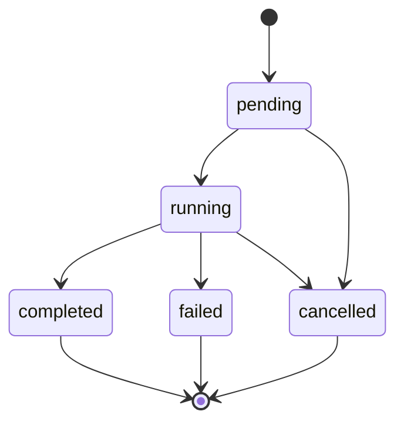
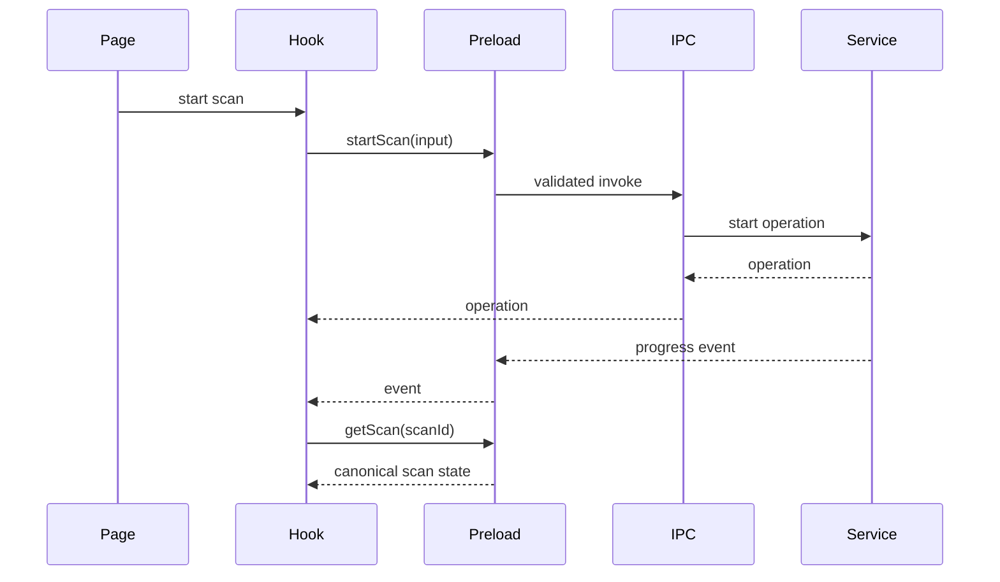

# IPC and Operations

## Purpose

This document defines the runtime contract between the renderer and Electron for Engineering Brain capabilities, including long-running operations, events, cancellation, background processing, diagnostics, and degraded states.

## Principles

1. IPC is typed and narrow.
2. Long-running work uses start/query/cancel/event patterns.
3. Electron owns operation state.
4. The renderer may reconnect to in-flight operations after reload.
5. Events are advisory; canonical state is queryable.
6. Errors are stable, safe, and actionable.
7. Operations are observable and cancellable.

## Desktop API shape

```ts
export interface EngineeringBrainDesktopApi {
  startOperation(
    request: StartEngineeringBrainOperationRequest,
  ): Promise<EngineeringBrainOperation>;

  getOperation(
    operationId: string,
  ): Promise<EngineeringBrainOperation | null>;

  listOperations(
    query?: ListEngineeringBrainOperationsQuery,
  ): Promise<EngineeringBrainOperation[]>;

  cancelOperation(operationId: string): Promise<void>;

  subscribe(
    listener: (event: EngineeringBrainEvent) => void,
  ): () => void;
}
```

Skill-specific APIs should remain explicit:

```ts
export interface BacklogDesktopApi {
  listJiraConnections(): Promise<JiraConnectionSummary[]>;
  saveJiraConnection(input: SaveJiraConnectionInput): Promise<JiraConnectionSummary>;
  testJiraConnection(id: string): Promise<JiraConnectionHealth>;
  previewJql(input: PreviewJqlInput): Promise<JqlPreview>;
  syncJiraProject(input: SyncJiraProjectInput): Promise<EngineeringBrainOperation>;
  listIssues(input: ListBacklogIssuesInput): Promise<BacklogIssuePage>;
  getIssue(id: string): Promise<BacklogIssueDetail>;
  saveMappings(input: SaveRepositoryMappingsInput): Promise<RepositoryMapping[]>;
  startScan(input: StartBacklogScanInput): Promise<EngineeringBrainOperation>;
  getAssessment(id: string): Promise<BacklogAssessmentDetail | null>;
  submitFeedback(input: SubmitAssessmentFeedbackInput): Promise<void>;
  exportReport(input: ExportBacklogReportInput): Promise<ExportResult>;
}
```

Avoid a generic `execute(command, payload)` API because it weakens validation, discoverability, and permission boundaries.

## Operation model

```ts
export type EngineeringBrainOperationStatus =
  | "pending"
  | "running"
  | "completed"
  | "failed"
  | "cancelled";

export interface EngineeringBrainOperation {
  id: string;
  kind: string;
  status: EngineeringBrainOperationStatus;
  stage: string | null;
  progress: number;
  createdAt: string;
  updatedAt: string;
  completedAt: string | null;
  error: PublicError | null;
  metadata: Record<string, unknown>;
}
```

Progress ranges from `0` to `1`. When total work is unknown, the operation should expose stage and indeterminate progress explicitly rather than fabricating percentages.

## Operation lifecycle



Terminal operations are immutable except for retention metadata.

## Events

```ts
export type EngineeringBrainEvent =
  | { type: "operation-created"; operation: EngineeringBrainOperation }
  | { type: "operation-progress"; operationId: string; stage: string; progress: number }
  | { type: "operation-warning"; operationId: string; warning: PublicWarning }
  | { type: "operation-completed"; operation: EngineeringBrainOperation }
  | { type: "operation-failed"; operation: EngineeringBrainOperation }
  | { type: "operation-cancelled"; operation: EngineeringBrainOperation }
  | { type: "assessment-created"; scanId: string; assessmentId: string }
  | { type: "assessment-stale"; assessmentId: string; reason: string };
```

Events must contain stable IDs so the renderer can invalidate and refetch canonical state.

## Preload

Preload responsibilities:

- expose `window.devdeck.engineeringBrain` and skill APIs;
- validate serialisable inputs;
- map internal IPC channels to methods;
- expose subscription wrappers;
- remove event listeners on unsubscribe;
- never expose `ipcRenderer` directly.

## IPC handlers

Handlers should be thin:

1. validate input;
2. call an owning service;
3. map errors;
4. return a DTO.

Business orchestration belongs in domain services, not handler registration.

## Input validation

Use Zod or equivalent schemas at the Electron boundary even when the renderer is typed. Types do not protect runtime IPC messages.

Validation should:

- reject malformed IDs;
- bound arrays and strings;
- reject unknown action types;
- validate paths indirectly through project IDs rather than accepting arbitrary roots;
- normalise optional values.

## Errors

```ts
export interface PublicError {
  code: string;
  message: string;
  retryable: boolean;
  details?: Record<string, string | number | boolean | null>;
}
```

Do not expose raw stack traces, credentials, source excerpts, or external response payloads.

Suggested error namespaces:

```text
ENGINEERING_BRAIN_*
JIRA_*
REPOSITORY_*
INDEX_*
RETRIEVAL_*
ASSESSMENT_*
PROVIDER_*
DATABASE_*
ACTION_*
```

## Cancellation

Cancellation is cooperative.

The operation service owns an `AbortController` for each active operation and propagates its signal to:

- HTTP requests;
- Git processes;
- filesystem enumeration;
- parsers;
- model requests;
- bounded queues.

Cancellation semantics:

- repeated cancellation is idempotent;
- completed operations cannot be cancelled;
- partial staging data is cleaned;
- previous ready state remains available;
- terminal state becomes `cancelled`.

## Progress

Progress is reported by meaningful units:

- Jira pages processed;
- repositories indexed;
- files processed;
- issues analysed;
- exports written.

Nested operations may expose child counts in metadata, but the top-level operation remains the user-facing unit.

## Operation persistence

Persist operations that:

- may outlive renderer reload;
- take more than a trivial duration;
- need diagnostics;
- create durable results.

On application restart, operations left in `pending` or `running` become `interrupted` internally and are reconciled to either `failed` or resumable state according to operation type.

Initial implementation may mark all interrupted scans failed with a retry action. Resume support should be added only when idempotency is proven.

## Background scheduler

The scheduler runs in Electron and owns:

- recurring Jira sync;
- repository freshness checks;
- targeted re-analysis;
- retention jobs;
- health checks.

Scheduler policies include:

- enabled state;
- cadence;
- quiet periods;
- network requirements;
- battery policy;
- maximum concurrent background operations;
- model cost budget.

## Duplicate-work prevention

Use operation keys:

```text
<operation-kind>:<scope-id>:<configuration-hash>
```

If an equivalent operation is active, return the existing operation or reject with a stable conflict response.

## Renderer data flow



## React Query integration

Hooks should:

- define stable query keys;
- subscribe once per relevant scope;
- invalidate queries from events;
- avoid treating event payloads as the only canonical state;
- surface cancellation and degraded states;
- clean subscriptions on unmount.

## Degraded modes

Examples:

- Jira unavailable: show local snapshot and sync warning;
- GitHub unavailable: continue with local Git;
- model unavailable: rules-only;
- repository unavailable: partial scan with clear scope warning;
- stale index: direct search or require refresh according to policy.

Warnings are distinct from terminal errors.

## Notifications

Native notifications may be used for:

- long scan completion;
- action required after failure;
- newly stale high-priority assessments;
- scheduled scan findings when enabled.

Notifications must be configurable and should link to the relevant route.

## Observability

Each operation records:

- ID and kind;
- source and scope IDs;
- start/end times;
- stages;
- progress units;
- warnings;
- error code;
- cancellation;
- retry count;
- degraded sources;
- relevant version metadata.

Logs must not contain credentials or unbounded source content.

## Health endpoints within desktop API

Expose a diagnostics summary rather than a network endpoint:

```ts
export interface EngineeringBrainHealth {
  database: ComponentHealth;
  jiraConnections: ComponentHealth[];
  repositoryIndexes: ComponentHealth[];
  modelProvider: ComponentHealth | null;
  scheduler: ComponentHealth;
}
```

## Testing

Required tests:

- IPC input rejection;
- event subscription/unsubscribe;
- start/query/cancel lifecycle;
- duplicate operation prevention;
- renderer reload and state refetch;
- interrupted-operation reconciliation;
- partial-source warnings;
- safe public errors;
- scheduler concurrency;
- packaged Electron behaviour.

## Open decisions

- whether scan resume is included in the first release;
- operation retention duration;
- notification defaults;
- whether child-operation state is exposed publicly;
- exact battery-awareness implementation on macOS.
