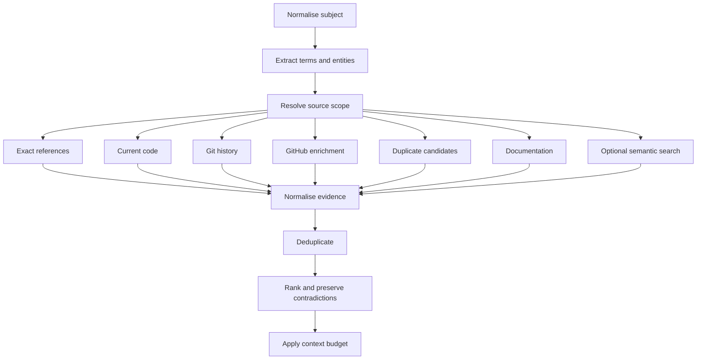

# Retrieval Engine

## Purpose

The Retrieval Engine converts a work item or engineering question into a bounded package of evidence from Jira, local Git, repository indexes, GitHub, documentation, and approved agent traces.

It is designed to maximise verifiability, not merely semantic similarity.

## Responsibilities

- normalise the analysis subject;
- resolve authorised repositories and sources;
- build multiple query strategies;
- execute deterministic retrieval first;
- rank and deduplicate evidence;
- preserve contradictions;
- enforce privacy and context budgets;
- return stable evidence IDs and provenance.

It does not make the final classification and does not execute actions.

## Retrieval contract

```ts
export interface RetrievalRequest {
  subject: RetrievalSubject;
  repositorySnapshotIds: string[];
  sourcePolicy: RetrievalSourcePolicy;
  budget: RetrievalBudget;
  signal?: AbortSignal;
}

export interface RetrievalResult {
  evidence: EngineeringEvidence[];
  diagnostics: RetrievalDiagnostics;
  omitted: OmittedEvidenceSummary[];
  contradictions: EvidenceContradiction[];
}
```

## Source order

The default order reflects evidence quality:

1. explicit Jira links and state;
2. exact issue-key references in Git and GitHub;
3. exact identifiers, paths, endpoints, and error messages;
4. current code and tests;
5. file and commit history;
6. duplicate issue candidates;
7. documentation and agent traces;
8. semantic retrieval when enabled.

The engine may execute independent stages in parallel, but ranking must preserve this hierarchy.

## Pipeline



## Subject normalisation

For a Jira issue, normalise:

- local issue ID;
- external issue ID and key;
- project;
- type and status;
- title and description;
- acceptance criteria;
- components and labels;
- links and parent relationships;
- creation and update dates;
- selected comments and history.

The original source snapshot remains available for inspection. Retrieval uses the normalised representation.

## Query planning

Generate several query classes rather than one model-authored search query.

### Exact references

- Jira issue key;
- linked issue keys;
- quoted identifiers;
- exact file paths;
- exact endpoint paths;
- exact error messages.

### Technical entities

- service names;
- modules;
- classes;
- functions;
- configuration keys;
- database tables;
- events;
- feature flags.

### Intent terms

Extract verbs and domain nouns from summary, description, and acceptance criteria.

Model-assisted extraction may enrich these terms, but deterministic parsing remains available.

## Query provenance

Every retrieved item records the query or rule that found it. This allows evaluation of which strategy contributed useful evidence.

## Exact-reference retrieval

Search:

- commit messages;
- branch names;
- PR title/body;
- issue links;
- source and documentation text;
- test names.

An exact issue-key match is strong linkage evidence, but it does not prove that all acceptance criteria were implemented.

## Current-code retrieval

Use the ready repository index and direct bounded searches.

Return:

- file and line range;
- symbol where available;
- snapshot ID and HEAD SHA;
- excerpt hash;
- match terms;
- relevance features.

## Historical retrieval

Git history can establish:

- implementation timing;
- file removal;
- rename history;
- introduction or removal of tests;
- commits that mention relevant concepts;
- partial implementation sequences.

Commands must be selected from safe predefined operations and use argument arrays.

## GitHub enrichment

GitHub evidence can add:

- PR merge state;
- canonical URL;
- title and description;
- changed files;
- review discussion;
- CI status.

Local Git remains usable if GitHub is unavailable.

## Duplicate candidate retrieval

The first implementation should use:

- FTS similarity;
- shared project/component;
- common technical terms;
- matching endpoints or errors;
- existing issue links;
- status and temporal overlap.

Duplicate retrieval returns candidates, not a duplicate classification.

## Documentation retrieval

Documentation may include:

- repository Markdown;
- ADRs;
- architecture docs;
- runbooks;
- approved project documents.

Documentation must be bound to source path and snapshot where possible.

## Agent trace retrieval

Agent traces can provide investigation history, commands, and test outcomes.

They are lower-authority evidence unless linked to durable repository or external-system changes.

## Evidence normalisation

All source adapters produce a common evidence structure.

```ts
export interface EvidenceFeatures {
  explicitReference: boolean;
  currentState: boolean;
  directness: number;
  sourceReliability: number;
  temporalRelevance: number;
  lexicalScore: number;
  semanticScore: number | null;
  contradictionValue: number;
}
```

## Deduplication

Deduplicate by source-specific identity:

- commit SHA;
- GitHub repository + PR number;
- Jira connection + issue ID;
- snapshot + path + line range + content hash;
- document ID + section hash.

When the same item is discovered by multiple queries, merge provenance and retain the strongest features.

## Ranking

Ranking is deterministic and versioned.

A starting formula may combine:

- explicit linkage;
- source authority;
- current-state relevance;
- direct acceptance-criteria overlap;
- temporal relevance;
- contradiction value;
- lexical and optional semantic scores;
- diversity penalty.

Ranking must avoid returning ten nearly identical snippets from one file when diverse evidence exists.

## Contradictions

The engine should actively retain evidence that challenges an apparent conclusion.

Examples:

- merged PR exists, but a test remains skipped;
- component removed, but a replacement service carries the same behaviour;
- issue marked fixed, but a recent comment reports reproduction;
- implementation exists behind a disabled feature flag.

Contradictions are first-class output, not ranking noise.

## Evidence strength

Evidence strength reflects linkage and authority, not final assessment confidence.

- **high:** exact linked PR/commit, direct current-code implementation, explicit removal.
- **medium:** strong structural or lexical correspondence.
- **low:** indirect semantic similarity, age, or absence signals.

## Context budgets

```ts
export interface RetrievalBudget {
  maxItems: number;
  maxCharacters: number;
  maxItemsPerSource: number;
  maxItemsPerRepository: number;
  reserveForContradictions: number;
}
```

Apply budgets after ranking and diversity selection.

Always reserve space for:

- issue source content;
- strongest explicit evidence;
- contradictions;
- evidence metadata.

## Omitted evidence

When evidence is omitted due to budget, report aggregate counts and reasons. The UI may allow users to load additional evidence without changing the original assessment automatically.

## Privacy policy

Before retrieval or model submission:

- apply source allowlists;
- exclude denied files;
- redact secrets;
- enforce provider data policy;
- avoid collecting source content that cannot be used.

## Caching

Cache source-query results by:

- source snapshot;
- query plan hash;
- retrieval engine version;
- policy hash.

Do not reuse cached results after repository, Jira, or policy changes invalidate them.

## Cancellation and failure

Each source stage is independently cancellable. A source failure produces diagnostics and partial results unless the required source set becomes unusable.

## Evaluation

Measure:

- evidence recall;
- evidence precision;
- rank quality;
- source diversity;
- duplicate-candidate quality;
- contradiction recall;
- latency;
- cache hit rate;
- context-budget utilisation.

## Testing

Required scenarios:

- exact issue-key commit and PR;
- implementation without issue key;
- component deletion;
- partial implementation;
- misleading lexical match;
- duplicate titles with different scope;
- contradictory evidence;
- GitHub outage;
- stale index;
- context budget pressure;
- cancellation.

## Future work

- learning-to-rank using explicit evaluation data;
- semantic index;
- knowledge graph traversal;
- deployment and incident sources;
- user-authored retrieval policies.
