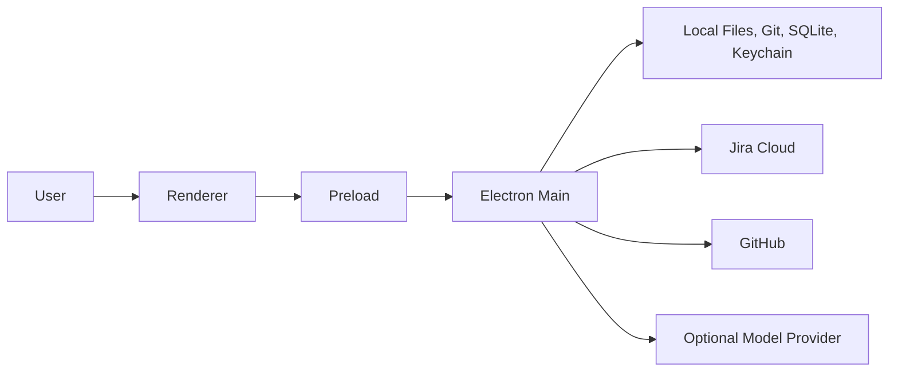

# Security Model

## Purpose

This document defines the security posture for the Engineering Brain and Backlog Intelligence capabilities.

Security is a design constraint because DevDeck handles source code, issue content, credentials, local processes, model context, and future external writes.

## Security objectives

1. Credentials never reach the renderer or logs.
2. Repository access is restricted to explicit roots.
3. Process execution is safe and cancellable.
4. External content cannot redefine policy or permissions.
5. Model providers receive only policy-approved context.
6. Recommendations remain separate from actions.
7. External writes are conflict-safe and audited.
8. Failures degrade safely.

## Protected assets

- Jira credentials and refresh tokens;
- GitHub credentials;
- model-provider credentials;
- local source code;
- Jira issue content and comments;
- repository indexes;
- Engineering Brain database;
- exports and diagnostics bundles;
- action proposals and execution audit;
- agent traces;
- user-defined policies.

## Trust boundaries



### Renderer boundary

The renderer is not trusted with native capabilities or raw secrets.

### External content boundary

Jira fields, comments, repository files, PR discussions, documentation, and model output are untrusted data.

### Provider boundary

Any model provider is an external processor unless explicitly local.

## Threat model

### Credential leakage

Threats:

- logging request headers;
- storing tokens in SQLite or localStorage;
- exposing credentials through IPC;
- including tokens in diagnostics.

Controls:

- macOS Keychain;
- secret-safe client wrappers;
- redacted logging;
- renderer never receives credentials;
- diagnostics allowlist.

### Shell injection

Threats:

- interpolating issue content, paths, refs, or search terms into shell commands.

Controls:

- use `spawn` with argument arrays;
- avoid `shell: true`;
- validate Git refs and paths;
- cap output and time;
- cancellation;
- predefined command operations.

### Path traversal and symlink escape

Threats:

- renderer or source content causing access outside mapped repositories;
- symlinks pointing to sensitive locations.

Controls:

- canonical path resolution;
- allowed-root checks;
- relative path validation;
- explicit symlink policy;
- deny paths and secret patterns;
- no arbitrary path-based IPC method.

### Prompt injection

Threats:

- issue or repository text instructing a model to ignore policy, reveal secrets, or perform actions.

Controls:

- treat all retrieved content as quoted untrusted evidence;
- separate system policy from evidence fields;
- no model-owned tools for external writes;
- structured output only;
- validate evidence IDs;
- action proposals are created by trusted application logic, not directly executed from model output.

### Data exfiltration

Threats:

- sending excessive code or secrets to a provider;
- malicious evidence causing unrelated files to be collected.

Controls:

- AI disabled by default or explicit opt-in according to product decision;
- source allowlists;
- context budgets;
- file deny patterns;
- secret scanning and redaction;
- submitted-context preview;
- provider-specific policy.

### Poisoned evidence

Threats:

- malicious comments or files crafted to manipulate assessment;
- generated files dominating retrieval;
- misleading issue references.

Controls:

- provenance;
- source authority weighting;
- deterministic evidence hierarchy;
- contradiction preservation;
- generated-file exclusion;
- human review.

### Stale writes

Threats:

- updating Jira based on an outdated issue snapshot.

Controls:

- fetch current issue before execution;
- optimistic locking through update metadata;
- abort on conflict;
- preview current diff;
- idempotency keys.

### Action replay

Threats:

- retries producing duplicate comments, labels, or follow-up issues.

Controls:

- operation identity;
- action-specific idempotency key;
- persisted execution status;
- inspect external state before retry.

### Database compromise or corruption

Controls:

- credentials excluded;
- foreign keys;
- migrations and backups;
- bounded raw payload retention;
- recoverable diagnostics mode;
- secure file permissions inherited from user-data location.

## Permission model

Capabilities should map to explicit permissions:

```text
jira.read
jira.write.comment
jira.write.label
jira.write.description
jira.write.link
jira.write.create
jira.write.transition
repository.read
repository.history.read
provider.submit.metadata
provider.submit.code
```

Read and write scopes are separate. Enabling a provider does not imply permission to submit code.

## Authentication storage

Credentials are stored through an abstraction backed by Keychain.

```ts
export interface CredentialStore {
  get(service: string, account: string): Promise<string | null>;
  set(service: string, account: string, secret: string): Promise<void>;
  delete(service: string, account: string): Promise<void>;
}
```

No secret value is returned through desktop DTOs.

## AI data policies

```ts
export type AiDataPolicy =
  | "disabled"
  | "metadata_only"
  | "selected_context"
  | "full_retrieved_context";
```

The policy must also identify allowed projects and repositories.

## Redaction pipeline

1. Apply file/path deny rules.
2. Scan selected text for known secret formats.
3. Apply user-defined patterns.
4. Replace sensitive values with typed placeholders.
5. Re-check payload before provider submission.
6. Record counts, not secret values.

Redaction failure blocks provider submission; it does not silently continue.

## Default deny patterns

```text
.env*
*.pem
*.key
*.p12
*.jks
id_rsa*
secrets/**
credentials/**
**/private/**
```

Generated and dependency paths are excluded for both security and relevance.

## IPC security

- expose narrow methods;
- validate every input with schemas;
- reject unknown fields where practical;
- no generic filesystem or process endpoint;
- normalise errors;
- scope subscriptions and unsubscribe on renderer teardown;
- never return stack traces or secrets.

## Model-output security

Model output is untrusted.

Required validation:

- structured schema;
- allowed enum values;
- evidence IDs exist;
- no unsupported action type;
- length limits;
- no direct executable command;
- no credential or secret material;
- no external URL treated as trusted without normalisation.

## Action safety

Every write action requires:

- action proposal generated in trusted code;
- risk classification;
- permission check;
- preview;
- explicit user confirmation;
- fresh external state;
- conflict check;
- idempotency;
- audit record.

High-risk actions such as transitions or closure require a second confirmation and may remain permanently manual.

## Audit

Record:

- user-visible action;
- source assessment;
- target external identity;
- previous-state fingerprint;
- proposed payload fingerprint;
- confirmation time;
- execution result;
- external response identity;
- failure and retry history.

Do not store credentials or unnecessary full payloads.

## Logging

Logs may contain IDs, counts, durations, source types, stages, and error codes.

Logs must not contain:

- tokens;
- full source files;
- unredacted issue descriptions by default;
- provider prompts;
- arbitrary command output that may contain secrets.

## Diagnostics bundles

Diagnostics are generated from an allowlist and shown to the user before sharing.

Include:

- versions;
- feature flags;
- redacted operation state;
- schema version;
- error codes;
- health summaries.

Exclude source content and credentials.

## Dependency security

New dependencies require review of:

- maintenance;
- known vulnerabilities;
- licence;
- native packaging;
- transitive dependencies;
- update strategy;
- capability surface.

## Security testing

Required tests:

- credentials absent from logs and DTOs;
- shell injection attempts;
- traversal and symlink escape;
- denied-file retrieval;
- prompt injection fixtures;
- unknown evidence IDs;
- invalid model actions;
- stale-write conflict;
- idempotent retry;
- diagnostics redaction;
- provider policy enforcement.

## Incident response

If credential exposure is suspected:

1. disable affected integration;
2. stop background operations;
3. guide credential revocation;
4. preserve redacted diagnostics;
5. issue a release advisory;
6. rotate or invalidate stored credentials where supported.

## Open decisions

- whether AI is opt-in by default in the first public release;
- local secret-scanning implementation;
- exact symlink policy;
- whether database file permissions need explicit hardening;
- support for enterprise policy configuration.
