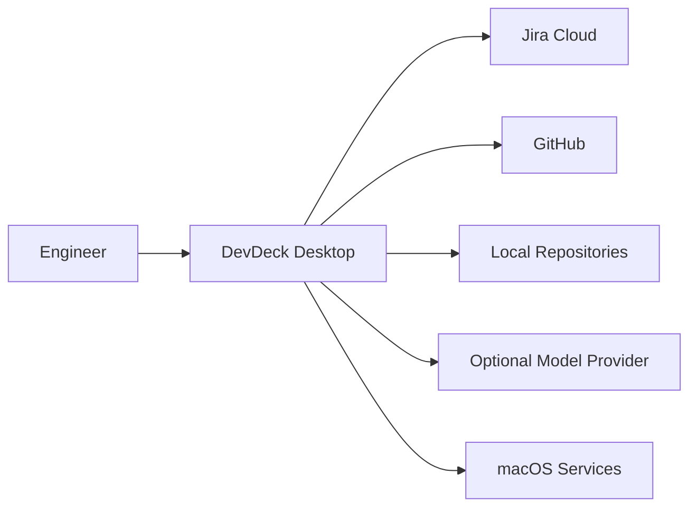
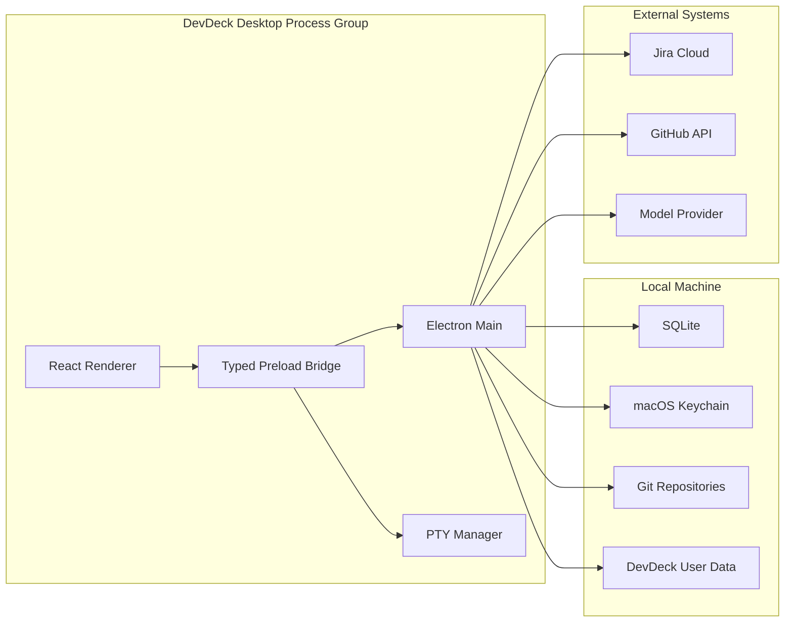
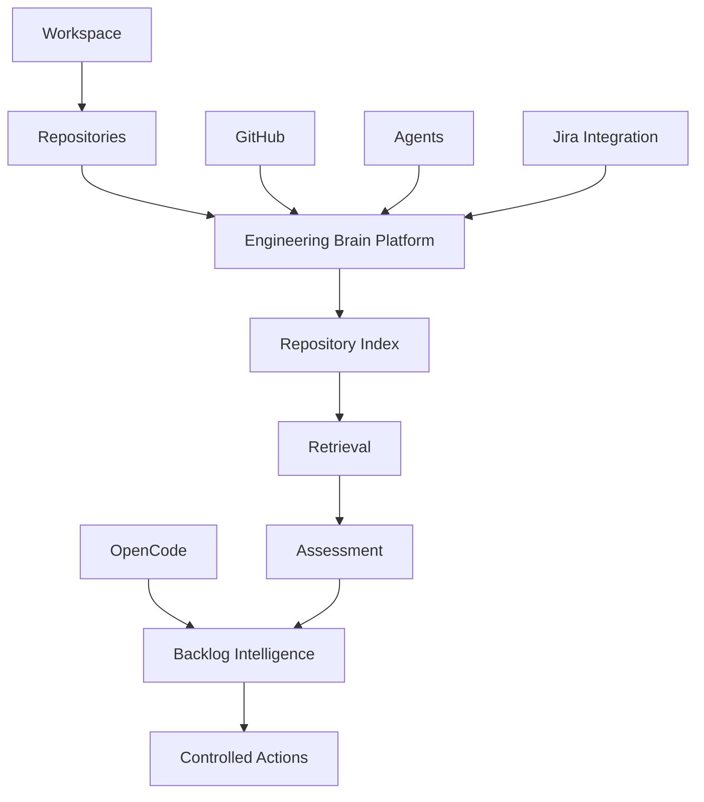
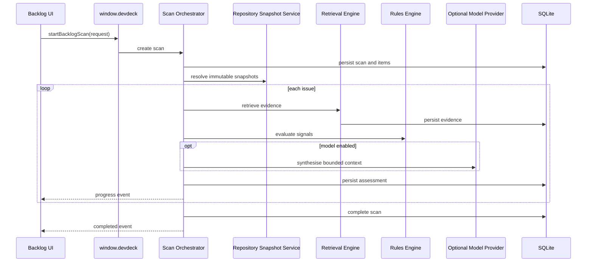

# System Overview

**Status:** Proposed architecture  
**Scope:** DevDeck Engineering Brain and Backlog Intelligence

---

## 1. Purpose

This document defines the system-level architecture for the Engineering Brain platform and its first skill, Backlog Intelligence.

It focuses on:

- runtime boundaries;
- ownership of state and side effects;
- domain decomposition;
- data and control flow;
- extension points;
- architectural invariants;
- deployment and failure boundaries.

It should be read together with:

- `docs/ENGINEERING_BRAIN_RFC.md`;
- `docs/ENGINEERING_CONSTITUTION.md`;
- `docs/ENGINEERING_PLAYBOOK.md`;
- `docs/BACKLOG_INTELLIGENCE_INTEGRATION_PLAN.md`.

---

## 2. System context

DevDeck is a local-first desktop application used by engineers to observe repositories, development activity, pull requests, agents, and eventually engineering knowledge.

The Engineering Brain extends DevDeck with a durable intelligence layer that connects:

- local repositories;
- Git history;
- GitHub metadata;
- Jira issues;
- agent traces;
- user feedback;
- optional model reasoning.



DevDeck remains operational when GitHub, Jira, or a model provider is unavailable, subject to the data already synchronised locally.

---

## 3. Runtime containers



### 3.1. Renderer

Responsibilities:

- route-level composition;
- user interaction;
- forms and validation feedback;
- React Query cache;
- review and triage UI;
- visualisation;
- accessibility.

Restrictions:

- no direct filesystem access;
- no direct Git execution;
- no direct credential access;
- no direct database access;
- no direct Jira, GitHub, or provider calls;
- no canonical persisted domain state.

### 3.2. Preload bridge

Responsibilities:

- expose the typed `window.devdeck` API;
- validate request and response payloads;
- hide IPC channel names;
- expose safe event subscriptions;
- return unsubscribe functions.

The preload bridge does not own business logic.

### 3.3. Electron main

Responsibilities:

- lifecycle and service composition;
- filesystem and Git access;
- SQLite ownership;
- Keychain access;
- integration clients;
- scan orchestration;
- indexing and retrieval;
- model-provider calls;
- background monitoring;
- notifications;
- exports;
- audit and diagnostics.

### 3.4. PTY manager

The PTY manager remains isolated from the Engineering Brain. Engineering Brain workflows may launch OpenCode sessions through existing typed launch contracts, but must not gain unrestricted PTY ownership.

---

## 4. Domain map



### 4.1. Existing domains

- workspace;
- repositories;
- GitHub;
- agents;
- OpenCode;
- terminals;
- telemetry.

### 4.2. New platform domains

- Engineering Brain operations;
- repository snapshots;
- evidence;
- retrieval;
- assessment;
- policy;
- audit;
- actions.

### 4.3. First skill domain

Backlog Intelligence owns:

- Jira issue interpretation;
- backlog classifications;
- backlog-specific rules;
- backlog scan orchestration policy;
- issue review UI;
- feedback taxonomy;
- Jira action proposals.

It does not own generic indexing, evidence storage, provider access, or operation lifecycle.

---

## 5. Dependency rules

Allowed dependency direction:

```text
UI → hooks → desktop API → Electron services → adapters/stores
                        ↓
                    shared contracts
```

Platform-to-skill direction:

```text
Engineering Brain platform ← Backlog Intelligence skill
```

The generic platform must not import backlog-specific classifications or Jira-specific concepts.

The Backlog skill may depend on:

- evidence APIs;
- scan APIs;
- repository snapshots;
- provider APIs;
- operation events.

---

## 6. Core runtime flow

### 6.1. Scan execution



### 6.2. Review flow

The renderer loads a normalised issue detail DTO containing:

- current Jira snapshot;
- scan metadata;
- repository snapshots;
- assessment;
- ranked evidence;
- contradictions;
- open questions;
- previous feedback;
- stale state.

Feedback is persisted through an explicit command and never modifies historical assessment output.

---

## 7. State ownership

| State | Owner |
|---|---|
| Workspace selection | Existing workspace domain |
| GitHub credential | Keychain / GitHub integration |
| Jira credential | Keychain / Jira integration |
| Jira issue snapshots | Engineering Brain SQLite store |
| Repository snapshot metadata | Engineering Brain SQLite store |
| Evidence | Engineering Brain SQLite store |
| Assessments | Backlog/assessment store |
| Human feedback | Assessment feedback store |
| Renderer cache | React Query |
| Temporary UI state | React components/hooks |
| Agent telemetry | Existing agent telemetry domain |

No state should have two canonical owners.

---

## 8. Operation model

Long-running work is represented as an operation with:

- stable ID;
- kind;
- status;
- progress;
- current stage;
- created/updated/completed timestamps;
- cancellation state;
- public error code.

Supported operation classes may include:

- Jira sync;
- repository index;
- backlog scan;
- export;
- targeted re-analysis;
- diagnostics collection.

Operations are queryable after completion and should survive renderer reloads. Whether active operations survive full app restart is a separate decision.

---

## 9. Extension model

A future Engineering Brain skill should implement:

```ts
interface EngineeringSkillDefinition<Input, Result> {
  id: string;
  version: string;
  validateInput(input: unknown): Input;
  buildQueries(input: Input): Promise<unknown[]>;
  evaluate(context: unknown): Promise<Result>;
}
```

This is a conceptual contract, not an immediate implementation requirement.

A skill owns domain meaning. Shared platform services own execution mechanics.

---

## 10. Failure boundaries

### Renderer failure

The renderer may reload without corrupting active persisted operations.

### Integration failure

A GitHub failure does not disable local Git evidence. A Jira failure does not invalidate already synchronised issue snapshots. A model failure falls back to rules-only operation.

### Per-item failure

One issue failure is isolated to one scan item.

### Database failure

Database unavailability is scan-fatal and must produce a clear diagnostic state.

### Repository failure

An unavailable repository results in partial analysis and a visible warning unless all required repositories are unavailable.

---

## 11. Security boundaries

- Renderer is untrusted relative to native capabilities.
- Jira, GitHub, repository text, and model output are untrusted content.
- Credentials remain in Keychain.
- Filesystem access is restricted to selected roots.
- Process execution uses argument arrays and no shell.
- External model transfer is policy-controlled and optional.
- Write-back is a separate permission and confirmation boundary.

---

## 12. Deployment model

The Engineering Brain ships inside the DevDeck desktop bundle.

No server deployment is required for the baseline architecture.

Optional external dependencies:

- Jira Cloud;
- GitHub;
- model provider.

Local dependencies:

- SQLite database;
- local repositories;
- macOS Keychain;
- DevDeck user-data directory.

---

## 13. Architectural quality attributes

### Reliability

- operation persistence;
- partial failure isolation;
- explicit degraded states;
- migration safety.

### Security

- least privilege;
- Keychain;
- strict IPC;
- path and process validation;
- prompt-injection controls.

### Performance

- incremental sync and indexing;
- bounded concurrency;
- context budgets;
- pagination;
- background throttling.

### Maintainability

- domain ownership;
- typed contracts;
- provider adapters;
- versioned schemas;
- ADRs.

### Explainability

- evidence provenance;
- deterministic signals;
- contradiction reporting;
- reproducibility metadata.

---

## 14. Open decisions

- SQLite driver and migration library;
- active-operation recovery after restart;
- generic skill interface timing;
- event bus implementation;
- repository snapshot invalidation granularity;
- degree of structural symbol indexing in the first release;
- default external-model data policy.

These decisions should be recorded in ADRs before implementation becomes dependent on them.
